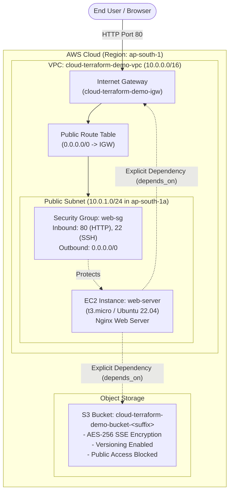

# Session 19: Cloud & Terraform in Action

An end-to-end Infrastructure-as-Code (IaC) project demonstrating cloud provisioning on Amazon Web Services (AWS) using HashiCorp Terraform.

---

## Table of Contents
1. [Project Overview](#project-overview)
2. [Architecture Diagram](#architecture-diagram)
3. [Terraform Concepts Demonstrated](#terraform-concepts-demonstrated)
   - [1. Terraform Providers](#1-terraform-providers)
   - [2. Variables and Types](#2-variables-and-types)
   - [3. Resources](#3-resources)
   - [4. Outputs](#4-outputs)
   - [5. Dependencies (Implicit & Explicit)](#5-dependencies-implicit--explicit)
   - [6. Terraform State Management](#6-terraform-state-management)
4. [Project Structure](#project-structure)
5. [Prerequisites & Environment Setup](#prerequisites--environment-setup)
6. [Step-by-Step Execution Guide](#step-by-step-execution-guide)
   - [Step 1: Code Formatting (`terraform fmt`)](#step-1-code-formatting)
   - [Step 2: Initialization (`terraform init`)](#step-2-initialization)
   - [Step 3: Validation (`terraform validate`)](#step-3-validation)
   - [Step 4: Dry-Run Execution Plan (`terraform plan`)](#step-4-dry-run-execution-plan)
   - [Step 5: Provision Infrastructure (`terraform apply`)](#step-5-provision-infrastructure)
   - [Step 6: Inspect State and Outputs (`terraform state` / `output`)](#step-6-inspect-state-and-outputs)
   - [Step 7: Clean Up Resources (`terraform destroy`)](#step-7-clean-up-resources)
7. [Screenshots Guide & Evidence](#screenshots-guide--evidence)
   - [Screenshot Checklist](#screenshot-checklist)
   - [AWS Console Navigation & Capture Guide](#aws-console-navigation--capture-guide)
   - [Screenshot Verification Gallery](#screenshot-verification-gallery)

---

## Project Overview

This project provisions a production-grade, secure, multi-tier cloud infrastructure baseline on AWS using Terraform. It automates the lifecycle of networking, compute, storage, and security components from initial dry-run planning to teardown.

### High-Level Architecture Flow:
```
                                 +-------------------------------------------------+
                                 |               AWS Cloud (ap-south-1)            |
                                 |                                                 |
                                 |  +-------------------------------------------+  |
                                 |  | Custom VPC (10.0.0.0/16)                  |  |
                                 |  |                                           |  |
Internet Gateway (igw) <=======> |  |  +-------------------------------------+  |  |
                                 |  |  | Public Subnet (10.0.1.0/24)         |  |  |
                                 |  |  |                                     |  |  |
                                 |  |  |  +-------------------------------+  |  |  |
                                 |  |  |  | Security Group (Port 80, 22)  |  |  |  |
                                 |  |  |  |                               |  |  |  |
                                 |  |  |  |   [ EC2 Web Server ]          |  |  |  |
                                 |  |  |  |   (Ubuntu / Nginx)            |  |  |  |
                                 |  |  |  +-------------------------------+  |  |  |
                                 |  |  +-------------------------------------+  |  |
                                 |  +-------------------------------------------+  |
                                 |                                                 |
                                 |  +-------------------------------------------+  |
                                 |  | Secure S3 Bucket                          |  |
                                 |  | - SSE-S3 AES-256 Encryption               |  |
                                 |  | - Versioning Enabled                      |  |
                                 |  | - Public Access Blocked                   |  |
                                 |  +-------------------------------------------+  |
                                 +-------------------------------------------------+
```

---

## Architecture Diagram

### Mermaid Diagram


---

## Terraform Concepts Demonstrated

### 1. Terraform Providers
Defined in [`providers.tf`](./providers.tf):
* **`hashicorp/aws` (~> 5.0)**: Interfaces with the AWS API to provision cloud resources in `ap-south-1`.
* **`hashicorp/random` (~> 3.5)**: Generates pseudo-random hexadecimal strings to guarantee globally unique S3 bucket names.
* **Default Tags**: Configured at the provider level (`Project`, `Environment`, `ManagedBy`, `Session`), propagating consistent metadata across all supported AWS resources automatically.

### 2. Variables and Types
Defined in [`variables.tf`](./variables.tf) and customized in [`terraform.tfvars`](./terraform.tfvars):
* Configures input parameters with clear descriptions, data types (`string`), and production-safe defaults.
* Demonstrates variable precedence: `terraform.tfvars` values seamlessly override defaults without modifying code.

### 3. Resources
A total of **12 distinct AWS and utility resources** are managed:
* `aws_vpc`: Dedicated network isolation.
* `aws_internet_gateway`: Ingress/egress edge for public internet access.
* `aws_subnet`: Public subnet associated with `ap-south-1a`.
* `aws_route_table` & `aws_route_table_association`: Route configuration sending outbound traffic via the Internet Gateway.
* `aws_security_group`: Stateful firewall with ingress rules for port 80 (HTTP) and port 22 (SSH), plus full egress.
* `aws_instance`: Virtual server running Nginx, initialized via dynamic user-data templating.
* `random_id`: Creates random 4-byte hex suffix for S3 uniqueness.
* `aws_s3_bucket`, `aws_s3_bucket_versioning`, `aws_s3_bucket_server_side_encryption_configuration`, `aws_s3_bucket_public_access_block`: Secure, hardened object storage.

### 4. Outputs
Defined in [`outputs.tf`](./outputs.tf):
* Exposes critical infrastructure attributes upon apply (`vpc_id`, `public_subnet_id`, `security_group_id`, `ec2_instance_id`, `ec2_public_ip`, `web_url`, `s3_bucket_name`).
* Enables consumption by downstream CI/CD pipelines or automated smoke testing scripts.

### 5. Dependencies (Implicit & Explicit)
* **Implicit Dependencies**: Terraform analyzes resource references to build a Directed Acyclic Graph (DAG).
  * Example: `aws_instance.web` references `aws_subnet.public.id` and `aws_security_group.web_sg.id`. Terraform automatically waits for the subnet and security group to be created before launching the instance.
* **Explicit Dependencies (`depends_on`)**: Defined in [`ec2.tf`](./ec2.tf):
  ```hcl
  depends_on = [
    aws_s3_bucket.app_bucket,
    aws_internet_gateway.igw
  ]
  ```
  Forces the EC2 instance provisioning to wait until both the S3 bucket and the Internet Gateway are active, preventing race conditions during bootstrap package installation.

### 6. Terraform State Management
* **`terraform.tfstate`**: The single source of truth mapping Terraform configuration to real-world cloud resources.
* **State Inspection**:
  * `terraform state list`: Enumerates all tracked resources.
  * `terraform state show <resource>`: Dumps live attributes recorded in state.
* **Remote State (Best Practice)**: For team production workflows, state can be migrated to an S3 backend with state locking via DynamoDB:
  ```hcl
  terraform {
    backend "s3" {
      bucket         = "my-terraform-state-bucket"
      key            = "session19/terraform.tfstate"
      region         = "ap-south-1"
      dynamodb_table = "terraform-locks"
      encrypt        = true
    }
  }
  ```

---

## Project Structure

```text
cloud-terraform/
├── .gitignore               # Ignores local state, secrets, and provider caches
├── providers.tf             # Provider definitions, versions, and default tags
├── variables.tf             # Input variable declarations with types & defaults
├── terraform.tfvars         # Variable values overriding defaults
├── vpc.tf                   # Networking: VPC, Subnet, IGW, Route Table
├── security.tf              # Security: Security Group (HTTP/SSH rules)
├── ec2.tf                   # Compute: EC2 Instance, user-data, dependencies
├── s3.tf                    # Storage: S3 Bucket, versioning, encryption, public block
├── outputs.tf               # Infrastructure outputs (IPs, URLs, IDs)
├── userdata.sh.tftpl        # Bootstrap template installing Nginx & dashboard
├── README.md                # Comprehensive documentation and guides
└── screenshots/             # Verification screenshots folder
    ├── README.md            # Detailed screenshot capture checklist
    ├── 01-terraform-init.png
    ├── 02-terraform-validate.png
    ├── 03-terraform-plan.png
    ├── 04-terraform-apply.png
    ├── 05-terraform-state-list.png
    ├── 06-terraform-output.png
    ├── 07-web-browser-verification.png
    ├── 08-aws-vpc-console.png
    ├── 09-aws-subnet-console.png
    ├── 10-aws-security-group.png
    ├── 11-aws-ec2-console.png
    ├── 12-aws-s3-console.png
    └── 13-terraform-destroy.png
```

---

## Prerequisites & Environment Setup

1. **Terraform**: Version `>= 1.5.0` installed.
   ```bash
   terraform version
   ```
2. **AWS CLI**: Installed and authenticated with valid IAM credentials.
   ```bash
   aws sts get-caller-identity
   ```
3. **IAM Permissions**: Sufficient permissions for EC2, VPC, and S3 resources.

---

## Step-by-Step Execution Guide

### Step 1: Code Formatting
Ensures standard canonical HCL formatting across all configuration files:
```bash
terraform fmt -check
```
*To automatically format all files:*
```bash
terraform fmt
```

### Step 2: Initialization
Downloads required provider plugins (`aws`, `random`) and configures the backend:
```bash
terraform init
```

### Step 3: Validation
Validates syntax and internal consistency of the configuration files:
```bash
terraform validate
```
*Expected output:*
```text
Success! The configuration is valid.
```

### Step 4: Dry-Run Execution Plan
Creates an execution plan, reading live state and comparing desired state against AWS:
```bash
terraform plan
```
*Expected output summary:*
```text
Plan: 12 to add, 0 to change, 0 to destroy.
```

### Step 5: Provision Infrastructure
Applies the changes to provision the infrastructure in AWS:
```bash
terraform apply
```
*(Enter `yes` when prompted, or run `terraform apply -auto-approve`)*

### Step 6: Inspect State and Outputs
Display all output values:
```bash
terraform output
```

List all managed resources in the Terraform state:
```bash
terraform state list
```

Inspect details of a specific resource:
```bash
terraform state show aws_instance.web
```

Verify the deployed web server in your terminal or browser:
```bash
curl $(terraform output -raw web_url)
```

### Step 7: Clean Up Resources
Destroy all provisioned infrastructure to avoid unnecessary AWS cloud costs:
```bash
terraform destroy
```
*(Enter `yes` when prompted, or run `terraform destroy -auto-approve`)*

*Expected output:*
```text
Destroy complete! Resources: 12 destroyed.
```

---

## Screenshots Guide & Evidence

### Screenshot Checklist

| File | What to Capture | Source |
|---|---|---|
| [`screenshots/01-terraform-init.png`](./screenshots/01-terraform-init.png) | Successful initialization and provider installation | Terminal |
| [`screenshots/02-terraform-validate.png`](./screenshots/02-terraform-validate.png) | `Success! The configuration is valid.` | Terminal |
| [`screenshots/03-terraform-plan.png`](./screenshots/03-terraform-plan.png) | Execution plan with `Plan: 12 to add...` | Terminal |
| [`screenshots/04-terraform-apply.png`](./screenshots/04-terraform-apply.png) | Successful apply output with generated outputs | Terminal |
| [`screenshots/05-terraform-state-list.png`](./screenshots/05-terraform-state-list.png) | `terraform state list` command output | Terminal |
| [`screenshots/06-terraform-output.png`](./screenshots/06-terraform-output.png) | `terraform output` terminal display | Terminal |
| [`screenshots/07-web-browser-verification.png`](./screenshots/07-web-browser-verification.png) | Browser displaying the live EC2 web server dashboard | Browser |
| [`screenshots/08-aws-vpc-console.png`](./screenshots/08-aws-vpc-console.png) | AWS VPC console showing `cloud-terraform-demo-vpc` | AWS Console |
| [`screenshots/09-aws-subnet-console.png`](./screenshots/09-aws-subnet-console.png) | AWS Subnets console showing `cloud-terraform-demo-public-subnet` | AWS Console |
| [`screenshots/10-aws-security-group.png`](./screenshots/10-aws-security-group.png) | AWS Security Groups showing HTTP & SSH inbound rules | AWS Console |
| [`screenshots/11-aws-ec2-console.png`](./screenshots/11-aws-ec2-console.png) | AWS EC2 console showing running instance and public IP | AWS Console |
| [`screenshots/12-aws-s3-console.png`](./screenshots/12-aws-s3-console.png) | AWS S3 console showing bucket properties (encryption & versioning) | AWS Console |
| [`screenshots/13-terraform-destroy.png`](./screenshots/13-terraform-destroy.png) | Successful `terraform destroy` confirmation | Terminal |

---

### AWS Console Navigation & Capture Guide

#### 1. VPC Console
* **Direct URL:** [https://ap-south-1.console.aws.amazon.com/vpc/home?region=ap-south-1#vpcs:](https://ap-south-1.console.aws.amazon.com/vpc/home?region=ap-south-1#vpcs:)
* **Filter:** Search `cloud-terraform-demo-vpc`
* **What to capture:** Check the box next to `cloud-terraform-demo-vpc` so the details pane at the bottom opens. Capture the table row and the **Details** tab showing IPv4 CIDR `10.0.0.0/16`.

#### 2. Subnet Console
* **Direct URL:** [https://ap-south-1.console.aws.amazon.com/vpc/home?region=ap-south-1#subnets:](https://ap-south-1.console.aws.amazon.com/vpc/home?region=ap-south-1#subnets:)
* **Filter:** Search `cloud-terraform-demo-public-subnet`
* **What to capture:** Select the subnet row. Verify CIDR `10.0.1.0/24`, Availability Zone `ap-south-1a`, and "Auto-assign public IPv4 address: Yes".

#### 3. Security Groups Console
* **Direct URL:** [https://ap-south-1.console.aws.amazon.com/ec2/home?region=ap-south-1#SecurityGroups:](https://ap-south-1.console.aws.amazon.com/ec2/home?region=ap-south-1#SecurityGroups:)
* **Filter:** Search `cloud-terraform-demo-web-sg`
* **What to capture:** Select `cloud-terraform-demo-web-sg` and click the **Inbound rules** tab in the bottom pane. Highlight the HTTP (port 80) and SSH (port 22) rules.

#### 4. EC2 Instances Console
* **Direct URL:** [https://ap-south-1.console.aws.amazon.com/ec2/home?region=ap-south-1#Instances:](https://ap-south-1.console.aws.amazon.com/ec2/home?region=ap-south-1#Instances:)
* **Filter:** Search `cloud-terraform-demo-web-server`
* **What to capture:** Select the instance. Capture the **Instance state (Running)** and the **Public IPv4 address** in the Details pane.

#### 5. S3 Buckets Console
* **Direct URL:** [https://s3.console.aws.amazon.com/s3/home?region=ap-south-1](https://s3.console.aws.amazon.com/s3/home?region=ap-south-1)
* **Filter:** Search `cloud-terraform-demo-bucket-`
* **What to capture:** Click into your bucket name and open the **Properties** tab. Capture the **Bucket Versioning (Enabled)** and **Default encryption (Server-side encryption with Amazon S3 managed keys SSE-S3)** cards.

---

### Screenshot Verification Gallery

*(Place image files inside the [`screenshots/`](./screenshots) directory with matching filenames to render below)*

#### 01. Terraform Init


#### 02. Terraform Validate


#### 03. Terraform Plan


#### 04. Terraform Apply


#### 05. Terraform State List


#### 06. Terraform Output


#### 07. Web Browser Verification


#### 08. AWS VPC Console


#### 09. AWS Subnet Console


#### 10. AWS Security Group


#### 11. AWS EC2 Console


#### 12. AWS S3 Console


#### 13. Terraform Destroy

