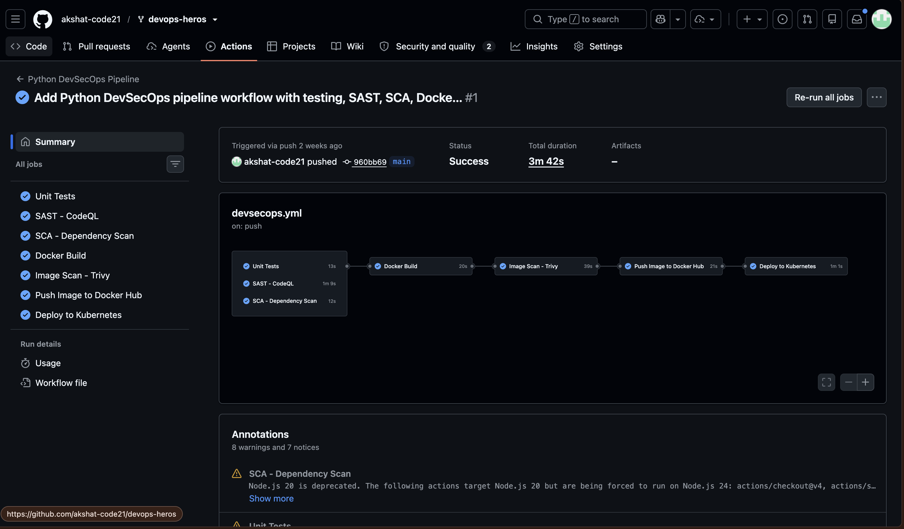

# Session 17: Complete CI/CD and DevSecOps

This assignment packages a Flask application into a Docker image and moves it
through automated testing, source and dependency security checks, image scanning,
registry publishing, and Kubernetes deployment.

## Deliverables

- Flask application and unit tests
- Dockerfile
- GitHub Actions workflow
- SAST, SCA, secret-scanning, and image-scanning configuration
- Kubernetes Deployment and Service manifests
- Security gates and deployment verification
- Successful pipeline output and documentation

## Project structure

The working implementation is in
[`session-17-devsecops/demo`](../../session-17-devsecops/demo/):

```text
demo/
├── app/
│   ├── app.py
│   ├── templates/index.html
│   └── static/
├── tests/test_app.py
├── k8s/
│   ├── deployment.yaml
│   └── service.yaml
├── .github/workflows/devsecops.yml
├── Dockerfile
├── requirements.txt
├── requirements-dev.txt
├── pytest.ini
├── SECURITY.md
└── README.md
```

## Expected DevSecOps flow

```text
Code push or pull request
	|
	v
Unit tests and coverage
	|
	+--> SAST: CodeQL
	|
	+--> SCA: pip-audit
	|
	v
Docker build
	|
	v
Trivy image scan
	|
	v
Security gates
	|
	v
Push image to Docker Hub
	|
	v
Deploy to Kind Kubernetes cluster
	|
	v
Rollout and HTTP verification
```

The workflow jobs are defined in
[`devsecops.yml`](../../session-17-devsecops/demo/.github/workflows/devsecops.yml).

## Application

The Flask application exposes a dashboard and API endpoints:

| Method | Endpoint | Purpose |
| :--- | :--- | :--- |
| `GET` | `/` | Dashboard UI |
| `GET` | `/health` | Health check |
| `GET` | `/api/status` | Runtime and uptime information |
| `GET` | `/api/greet/<name>` | Greeting response |
| `POST` | `/api/add` | Add two numbers |
| `POST` | `/api/calculate` | Arithmetic operations |
| `POST` | `/api/pipeline/run` | Demonstration pipeline run |

Run it locally:

```bash
cd ../../session-17-devsecops/demo
python3 -m venv .venv
source .venv/bin/activate
python3 -m pip install -r requirements.txt
python3 app/app.py
```

The application listens on port `5001`:

```bash
curl http://localhost:5001/health
curl http://localhost:5001/api/status
curl -X POST http://localhost:5001/api/add \
  -H 'Content-Type: application/json' \
  -d '{"number1": 10, "number2": 20}'
```

## Unit testing

Development dependencies are listed in
[`requirements-dev.txt`](../../session-17-devsecops/demo/requirements-dev.txt).
The test suite covers the home page, health endpoint, greeting, addition,
validation errors, calculator operations, division by zero, and status output.

```bash
python3 -m pip install -r requirements-dev.txt
pytest --cov=app --cov-report=term-missing
```

Expected result from the supplied tests:

```text
8 passed
```

The GitHub Actions `test` job runs the same test command with Python 3.12. A test
failure stops the dependent Docker build and all later delivery stages.

## Docker image build

The [`Dockerfile`](../../session-17-devsecops/demo/Dockerfile) uses
`python:3.12-slim`, installs only runtime requirements, copies the application,
exposes port `5001`, and starts `app/app.py`.

Build and run it locally:

```bash
docker build -t hey-cicd:local ../../session-17-devsecops/demo
docker run --rm -p 5001:5001 hey-cicd:local
curl http://localhost:5001/health
```

The CI workflow tags the image with the commit SHA:

```text
akshatscaler21/hey-ci-cd:<commit-sha>
```

It also tags the pushed image as `latest`.

## Security controls

### SAST: CodeQL

Static Application Security Testing analyzes source code without running the
application. The `sast` job uses GitHub CodeQL for Python:

```yaml
permissions:
  contents: read
  security-events: write
```

CodeQL findings should be reviewed in the repository Security and code-scanning
areas. A clean CodeQL result does not prove that dependencies, secrets, or the
container image are safe.

### SCA: pip-audit

Software Composition Analysis checks third-party packages for known
vulnerabilities:

```bash
python3 -m pip install -r requirements.txt
python3 -m pip install pip-audit
pip-audit
```

The workflow installs the application requirements and runs `pip-audit`. If the
command exits nonzero, the `sca` job fails and `docker-build` does not run.

### Secret scanning

Secret scanning protects credentials such as API keys, passwords, tokens, private
keys, and cloud credentials. No real secret belongs in this repository.

The current workflow consumes credentials through GitHub Actions secrets:

```yaml
password: ${{ secrets.DOCKERHUB_TOKEN }}
```

Enable GitHub Secret Scanning and Push Protection in the repository Security
settings. This is a repository security feature, not a separate job in the
supplied `devsecops.yml`. A safe local pattern is:

```python
import os

api_key = os.getenv("API_KEY")
```

If a real credential is exposed, revoke or rotate it immediately, investigate
usage, remove it from the repository history as required, and store the replacement
in a secret manager.

### Container image scanning: Trivy

Trivy scans the final image, including its operating-system packages, Python
packages, and system libraries:

```bash
trivy image --severity HIGH,CRITICAL hey-cicd:local
```

The workflow rebuilds the SHA-tagged image and scans it before the push job.

For a strict blocking gate, use `--exit-code 1`:

```bash
trivy image \
  --severity HIGH,CRITICAL \
  --exit-code 1 \
  akshatscaler21/hey-ci-cd:<commit-sha>
```

The supplied workflow sets the severity filter but does not currently set
`--exit-code 1`. Therefore, add that flag if HIGH or CRITICAL findings must stop
the pipeline rather than only being reported.

## Security gates and job dependencies

The workflow uses `needs` to control delivery:

```text
test   +   sast   +   sca
	      |
	      v
	docker-build
	      |
	      v
	 image-scan
	      |
	      v
	     push
	      |
	      v
	   deploy
```

The current gates are:

| Job | Gate behavior |
| :--- | :--- |
| `test` | Unit-test failure stops dependent delivery jobs |
| `sast` | CodeQL job must complete successfully |
| `sca` | `pip-audit` failure blocks Docker build |
| `docker-build` | A Docker build failure blocks image scanning and push |
| `image-scan` | Trivy job must complete before push; add `--exit-code 1` for a strict vulnerability gate |
| `push` | Registry failure prevents deployment |
| `deploy` | Rollout failure makes the deployment job fail |

This is the difference between running security tools and enforcing security
policy: a gate decides whether the next stage is allowed to continue.

## Container registry

The supplied workflow publishes to Docker Hub using the repository account
`akshatscaler21` and the secret `DOCKERHUB_TOKEN`:

```yaml
- uses: docker/login-action@v3
  with:
    username: akshatscaler21
    password: ${{ secrets.DOCKERHUB_TOKEN }}
```

Required setup:

1. Create a Docker Hub access token with the minimum required permissions.
2. Add it to GitHub as the `DOCKERHUB_TOKEN` repository secret.
3. Do not put the token in YAML, Python, Dockerfiles, or commit history.
4. Confirm the pushed SHA tag exists before deployment.

The earlier registry exercise also demonstrates GHCR with `GITHUB_TOKEN`, but the
actual Session 17 demo workflow uses Docker Hub, so the Kubernetes manifest uses
the Docker Hub image name.

## Kubernetes deployment

The manifests are:

- [`deployment.yaml`](../../session-17-devsecops/demo/k8s/deployment.yaml): two
  replicas, port `5001`, and the SHA-tagged Docker Hub image.
- [`service.yaml`](../../session-17-devsecops/demo/k8s/service.yaml): NodePort
  Service on port `30001`, forwarding to container port `5001`.

Deploy manually to a local cluster:

```bash
cd ../../session-17-devsecops/demo
kubectl apply -f k8s/deployment.yaml
kubectl apply -f k8s/service.yaml
kubectl get deployment session17-python
kubectl get pods -o wide
kubectl get service session17-python
```

For a local image, change the manifest image to a tag available in the cluster or
load the image into Kind/Minikube. The checked-in manifest contains the
`__IMAGE_TAG__` placeholder, which the workflow replaces with the current commit
SHA before applying it.

Verify the Service locally:

```bash
kubectl port-forward service/session17-python 5001:80
curl http://localhost:5001/
curl http://localhost:5001/api/status
```

The workflow performs the same deployment verification after creating a temporary
Kind cluster:

```bash
kubectl rollout status deployment/session17-python --timeout=60s
kubectl port-forward service/session17-python 5001:80
curl -s http://localhost:5001
curl -s http://localhost:5001/api/status
```

This workflow deploys to Kind on the GitHub-hosted runner. It is suitable for
pipeline validation, but it is not a persistent production cluster. Production CD
would require a reachable cluster and securely configured Kubernetes credentials.

## Local workflow

Run the main checks before pushing:

```bash
cd ../../session-17-devsecops/demo
python3 -m pip install -r requirements-dev.txt
pytest --cov=app --cov-report=term-missing
docker build -t hey-cicd:local .
trivy image --severity HIGH,CRITICAL hey-cicd:local
helm lint . 2>/dev/null || true
```

The final command is not required for this project because it is not a Helm chart;
the important local checks are tests, Docker build, and Trivy scan.

## Trigger and inspect the pipeline

The workflow runs on pushes and pull requests targeting `main`:

```bash
git add .
git commit -m "Run DevSecOps pipeline"
git push origin main
```

Then open the repository's **Actions** tab. A successful run should show these jobs
in order or parallel groups:

```text
Unit Tests       passed
SAST - CodeQL    passed
SCA              passed
Docker Build     passed
Image Scan       passed
Push Image       passed
Deploy           passed on push to main
```

SAST, SCA, and the initial test job can run independently. Docker build waits for
all three. Image scanning waits for Docker build, push waits for image scanning,
and deployment waits for push.

## Failure scenarios and remediation

### Unit test failure

Change an expected calculator result or endpoint response. The test job fails and
the dependent Docker build is skipped. Restore the implementation, rerun tests,
and push the fix.

### SCA finding

When `pip-audit` reports a vulnerable package, identify the package and installed
version, update `requirements.txt` to a fixed compatible version, rerun tests, and
run `pip-audit` again.

### Image vulnerability

Review the Trivy package and CVE output. Update the base image or dependency,
rebuild the image, rescan it, and only then publish it. Use `--exit-code 1` when
the policy requires the scan to block delivery.

### Deployment failure

```bash
kubectl get pods
kubectl describe pod <pod-name>
kubectl logs <pod-name>
kubectl get events --sort-by=.lastTimestamp
kubectl rollout status deployment/session17-python
```

Check that the pushed image tag matches the Deployment, that the cluster can pull
the image, and that the application responds on port `5001`.

## Evidence

Successful pipeline output should show the test, SAST, SCA, Docker build, image
scan, push, and deployment jobs passing. The captured Actions summary shows all
seven pipeline jobs completing successfully.



