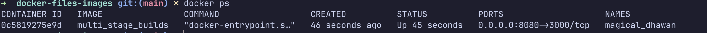

# Docker Multi-Stage Build Homework

## Task 1: Multi-Stage Dockerfile

The multi-stage Node.js application was built and run successfully.

### Build the image

```bash
docker build -t multi_stage_builds .
```

### Run the container

The application listens on port `3000` inside the container. It is published on port `8080` of the host.

```bash
docker run -p 8080:3000 -d multi_stage_builds
```

### Verify the application

Open [http://localhost:8080](http://localhost:8080) or run:

```bash
curl http://localhost:8080
```

Expected output:

```html
<h1>Hello World from Docker Multi-Stage Build!</h1>
```


### Verify the container and port

```bash
docker ps
```

The running container is published as `0.0.0.0:8080->3000/tcp`.




### Build and run evidence


## Task 3: Docker Application Deployments

Three different application types were built and deployed with Docker:

| Application | Image | Container port | Host port | Verification |
| --- | --- | ---: | ---: | --- |
| Node.js | `node-app` | 3000 | 3000 | `curl http://localhost:3000` returns `Hello World` |
| Python FastAPI | `python-app` | 8000 | 8000 | `curl http://localhost:8000/` returns a successful JSON response |
| Java Spring Boot | `java-app` | 8080 | 8080 | `curl http://localhost:8080/` returns `Hello World` |

### Node.js evidence


### Python evidence


### Java evidence


