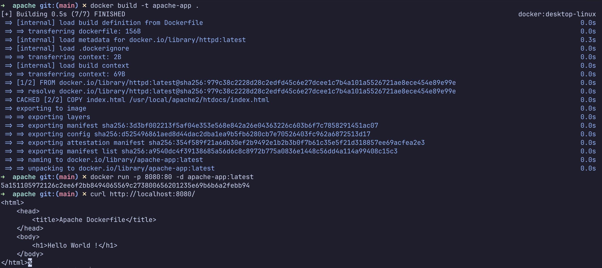
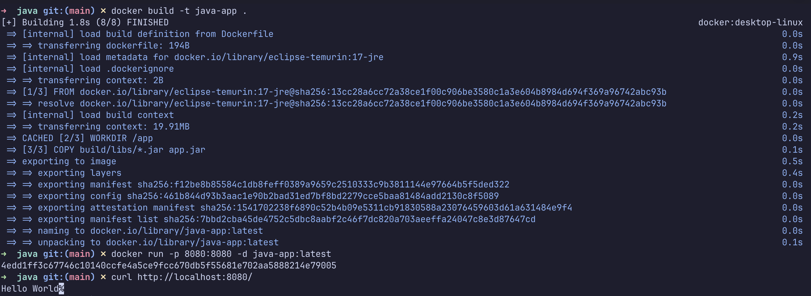
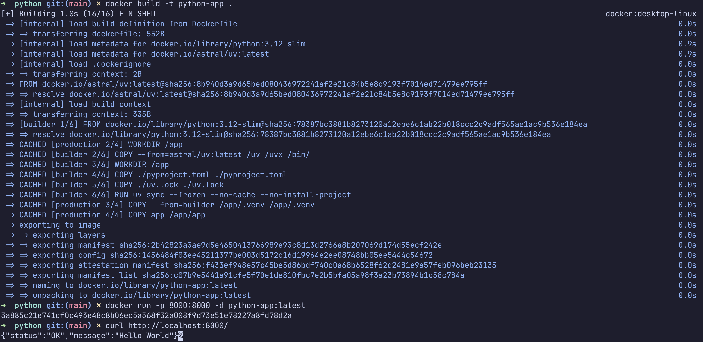

# Docker Fundamentals: Hello World Applications

The implementation folders of this assignment are:

```text
docker-fundamentals/
├── apache/
│   ├── Dockerfile
│   └── index.html
├── java/
│   ├── Dockerfile
│   └── src/
├── nginx/
│   ├── Dockerfile
│   └── index.html
├── nodejs/
│   ├── Dockerfile
│   ├── index.js
│   └── package.json
├── python/
│   ├── Dockerfile
│   ├── app/
│   └── pyproject.toml
├── react/
│   ├── Dockerfile
│   ├── package.json
│   └── src/
└── screenshots/
```

## Applications

| Application | Folder | Container port | Host port |
| --- | --- | ---: | ---: |
| Node.js | `nodejs/` | 3000 | 3000 |
| Python | `python/` | 8000 | 8000 |
| Java | `java/` | 8080 | 8080 |
| Apache | `apache/` | 80 | 8080 |
| React | `react/` | 5173 | 5173 |
| Nginx | `nginx/` | 80 | 8081 |

## Build and Run

Run each command from the `assignments/docker-fundamentals` directory.

### Node.js

```bash
cd nodejs
docker build -t node-app .
docker run --name node-app -p 3000:3000 -d node-app
curl http://localhost:3000
cd ..
```

Expected response: `Hello World`

### Python

```bash
cd python
docker build -t python-app .
docker run --name python-app -p 8000:8000 -d python-app
curl http://localhost:8000
cd ..
```

Expected response: `{"status":"OK","message":"Hello World"}`

### Java

Build the application JAR before building the Docker image:

```bash
cd java
./gradlew bootJar
docker build -t java-app .
docker run --name java-app -p 8080:8080 -d java-app
curl http://localhost:8080
cd ..
```

Expected response: `Hello World`

### Apache

```bash
cd apache
docker build -t apache-app .
docker run --name apache-app -p 8080:80 -d apache-app
curl http://localhost:8080
cd ..
```

Expected page heading: `Hello World !`

### React

```bash
cd react
docker build -t react-app .
docker run --name react-app -p 5173:5173 -d react-app
open http://localhost:5173
cd ..
```

Expected page text: `Hello World`

### Nginx

```bash
cd nginx
docker build -t nginx-app .
docker run --name nginx-app -p 8081:80 -d nginx-app
curl http://localhost:8081
cd ..
```

Expected page heading: `Hello World !`

## Verification Screenshots

The screenshots below show successful image builds, running containers, and Hello World responses.

### Apache



### Java



### Nginx


### Node.js


### Python



### React


