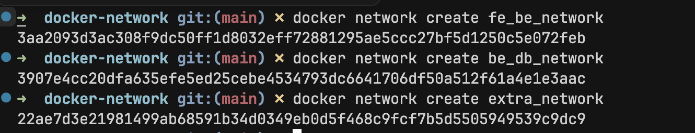
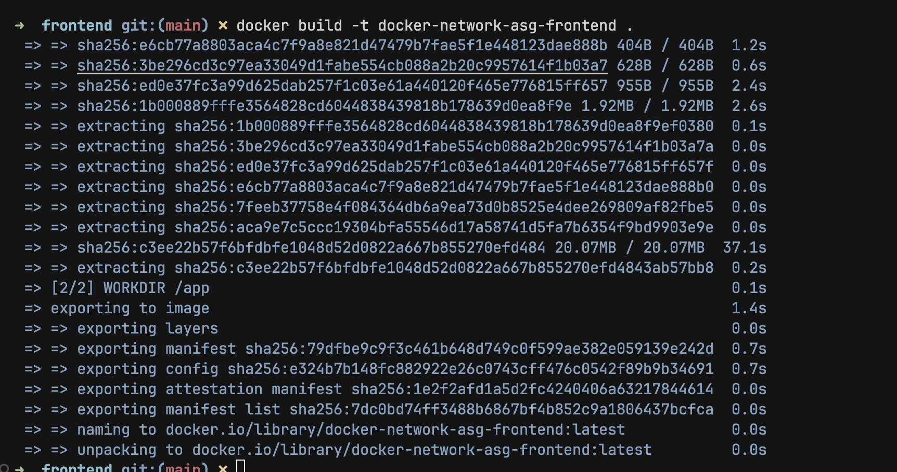
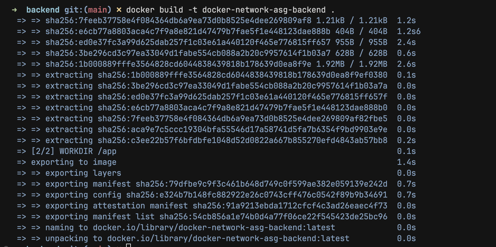
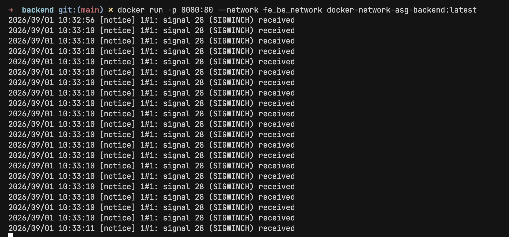
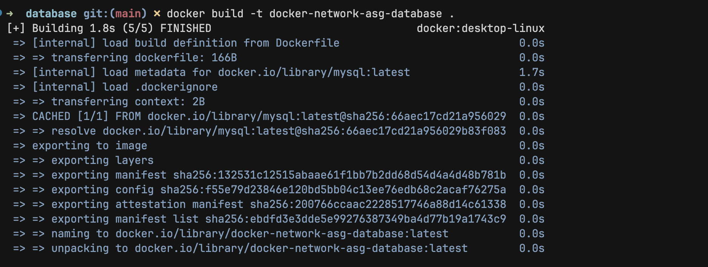
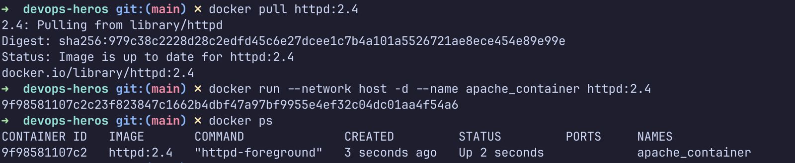

# Docker Networking & Volume Homework Tasks

## Task 1: Docker Container Networking

This task demonstrates Docker networking with a frontend container, backend container, and database container connected through multiple custom Docker networks.

### Create Docker networks

### Build frontend image

### Run frontend container

### Build backend image

### Run backend container

### Build database image

### Run database container

### Connect backend to multiple networks

### Verify connectivity between containers

---

## Task 2: Host Network

### Pull Apache image

### Run Apache container on host network

---

## Task 3: Bind Mount

### Start NGINX with bind mount

### Access the mounted web page

### Verify the updated content without restarting container

---

## Task 4: Overlay Network

Docker overlay networks are used when containers need to communicate across multiple Docker hosts in a swarm or multi-host environment. Unlike bridge networks, which work only on a single host, overlay networks create a virtual network that spans several machines.

### Use cases

- Communication between containers running on different Docker hosts
- Multi-host application deployments in Docker Swarm
- Service discovery between containers in a distributed setup
- Scalable microservices architectures

### How overlay networks work

Overlay networks use a virtual network layer that is managed by Docker and sits above the host network. Docker encapsulates container traffic and forwards it between hosts so that containers can communicate as though they are on the same local network.

### Key points

- Overlay networks are designed for multi-host communication.
- Containers on different nodes can connect to each other through the overlay network.
- Docker Swarm is commonly used with overlay networking.
- They are especially useful when building distributed applications across multiple machines.

### Example concept

When an application has frontend and backend containers running on different hosts, the overlay network allows them to communicate using container names or service names instead of host IPs alone.

### Summary

Overlay networks are essential for connecting containers across multiple Docker hosts, making them a core feature for production distributed deployments.
