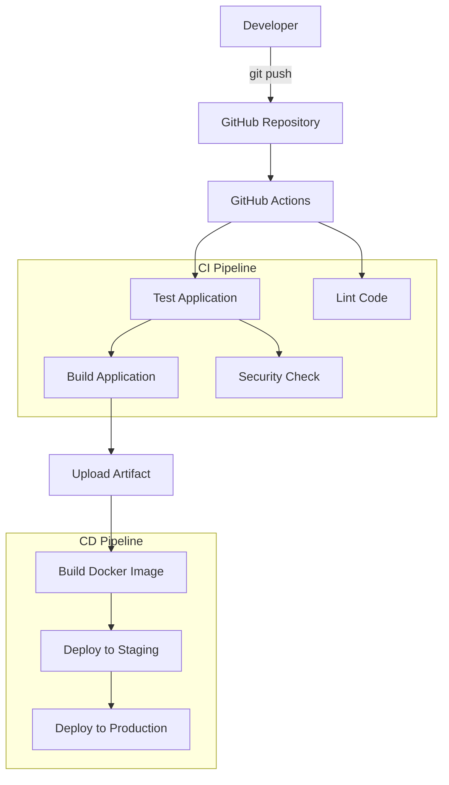

# Session 16: CI/CD & GitHub Actions — Demo Project

## 📋 Project Overview

This is a complete CI/CD demo project built with **GitHub Actions** for **Session 16: CI/CD & GitHub Actions**. It demonstrates every core concept of CI/CD pipelines using a Python Calculator application.

---

## 🏗️ Architecture



---

## 🔑 Key Concepts Covered

### CI vs CD

| Aspect | CI (Continuous Integration) | CD (Continuous Delivery/Deployment) |
|--------|---------------------------|-------------------------------------|
| **Goal** | Merge code changes frequently and verify with automated tests | Automatically deliver/deploy tested code to environments |
| **Scope** | Build + Test + Lint + Security | Docker Build + Staging + Production |
| **Trigger** | Every push/PR to `main` | After CI pipeline succeeds |
| **Workflow** | `.github/workflows/ci.yml` | `.github/workflows/cd.yml` |

### CI/CD Pipeline

The pipeline is a series of automated stages that code passes through from commit to deployment:

```
git push → CI (Test → Lint → Build → Security) → CD (Docker → Staging → Production)
```

### GitHub Actions

GitHub Actions is the CI/CD platform built into GitHub. It uses YAML workflow files stored in `.github/workflows/`.

### Workflow

A **workflow** is an automated process defined in a YAML file. This project has two workflows:
- **CI Pipeline** (`ci.yml`) — Runs on every push/PR
- **CD Pipeline** (`cd.yml`) — Runs after CI succeeds

### Jobs

A **job** is a set of steps that execute on the same runner. Jobs can run in parallel or sequentially using the `needs` keyword.

| Pipeline | Jobs |
|----------|------|
| CI | `test`, `lint`, `build`, `security-check` |
| CD | `docker-build`, `deploy-staging`, `deploy-production` |

### Steps

**Steps** are individual tasks within a job. Each step either runs a shell command (`run`) or uses a pre-built action (`uses`).

Example from the CI pipeline:
```yaml
steps:
  - name: Checkout source code        # Step 1: uses an action
    uses: actions/checkout@v4
  - name: Run tests                    # Step 2: runs a command
    run: pytest -v
```

### Runners

**Runners** are the machines that execute the jobs. This project uses GitHub-hosted runners:
```yaml
runs-on: ubuntu-latest
```

### Secrets

**Secrets** are encrypted environment variables stored in GitHub repository settings. The CD pipeline uses:
- `DOCKER_USERNAME` — Docker Hub username
- `DOCKER_PASSWORD` — Docker Hub access token

Secrets are referenced as: `${{ secrets.DOCKER_USERNAME }}`

### Artifacts

**Artifacts** are files produced during a workflow run that can be downloaded or passed between jobs:
```yaml
- name: Upload build artifact
  uses: actions/upload-artifact@v4
  with:
    name: calculator-build
    path: build/
```

---

## 📂 Project Structure

```
github-actions/
├── .github/
│   └── workflows/
│       ├── ci.yml              # CI Pipeline workflow
│       └── cd.yml              # CD Pipeline workflow
├── app/
│   ├── __init__.py             # Python package init
│   └── calculator.py           # Application source code
├── tests/
│   ├── __init__.py             # Tests package init
│   └── test_calculator.py      # Unit tests
├── build.sh                    # Build script
├── Dockerfile                  # Docker configuration
├── requirements.txt            # Python dependencies
├── .gitignore                  # Git ignore rules
└── README.md                   # This file
```

---

## 🔄 CI Pipeline (`.github/workflows/ci.yml`)

Triggers on: `push` to main, `pull_request` to main, `workflow_dispatch`

```text
CI Pipeline
│
├── ✓ Test Application          (Job 1 - runs pytest)
│
├── ✓ Lint Code                 (Job 2 - runs flake8, parallel with test)
│
├── ✓ Build Application         (Job 3 - needs: test)
│   └── ✓ Upload build artifact
│
└── ✓ Security Check            (Job 4 - needs: test)
```

### Job Dependencies:
- `test` and `lint` run **in parallel**
- `build` runs only **after test passes** (`needs: test`)
- `security-check` runs only **after test passes** (`needs: test`)

---

## 🚀 CD Pipeline (`.github/workflows/cd.yml`)

Triggers on: `workflow_run` (after CI Pipeline completes), `workflow_dispatch`

```text
CD Pipeline
│
├── ✓ Build Docker Image        (Job 1 - builds & pushes to Docker Hub)
│
├── ✓ Deploy to Staging         (Job 2 - needs: docker-build)
│
└── ✓ Deploy to Production      (Job 3 - needs: deploy-staging)
```

### Job Dependencies:
- `docker-build` → `deploy-staging` → `deploy-production` (sequential)
- Only runs if CI pipeline **succeeded**

---

## 🐳 Dockerfile

The Dockerfile uses a **multi-stage build**:

| Stage | Purpose |
|-------|---------|
| `base` | Installs dependencies and copies source code |
| `test` | Runs tests inside the container |
| `production` | Lean production image with only app code |

---

## 🏃 Run Locally

### Install dependencies:
```bash
python3 -m pip install -r requirements.txt
```

### Run the application:
```bash
python3 app/calculator.py
```

### Run tests:
```bash
pytest -v
```

### Build:
```bash
chmod +x build.sh
./build.sh
```

### Docker build:
```bash
docker build -t calculator-app .
docker run -it calculator-app
```

---

## 📤 Git Commands to Push

```bash
git init
git add .
git commit -m "Add complete CI/CD pipeline with GitHub Actions"
git branch -M main
git remote add origin https://github.com/YOUR_USERNAME/session16-cicd-github-actions.git
git push -u origin main
```

---

## 🔐 Setting Up Secrets

To enable the CD pipeline, add these secrets in your GitHub repository:

1. Go to **Settings** → **Secrets and variables** → **Actions**
2. Click **New repository secret**
3. Add:
   - `DOCKER_USERNAME` — Your Docker Hub username
   - `DOCKER_PASSWORD` — Your Docker Hub access token

---

## ✅ Expected Pipeline Execution

### Successful Run:
```text
CI Pipeline
├── ✓ Test Application        (5 tests passed)
├── ✓ Lint Code               (no errors)
├── ✓ Build Application       (artifact uploaded)
└── ✓ Security Check          (no sensitive files)

CD Pipeline (triggered automatically)
├── ✓ Build Docker Image      (pushed to Docker Hub)
├── ✓ Deploy to Staging       (staging environment)
└── ✓ Deploy to Production    (production environment)
```

### Failure Scenario:
Break the app intentionally:
```python
def add(a, b):
    return a + b + 1  # Bug introduced
```

Push the change. Expected:
```text
CI Pipeline
├── ✗ Test Application        (test_add FAILED)
├── ✓ Lint Code               (still passes)
├── ⊘ Build Application       (SKIPPED - needs test)
└── ⊘ Security Check          (SKIPPED - needs test)

CD Pipeline: NOT TRIGGERED (CI failed)
```

This demonstrates that `needs: test` blocks downstream jobs when tests fail — a core CI/CD safety mechanism.

### Fix and Re-run:
```python
def add(a, b):
    return a + b  # Fixed
```

```bash
git add .
git commit -m "Fix calculator add function"
git push
```

All jobs pass again. ✅

---

## 📊 Complete Concept Map

```text
CI/CD
│
├── CI (Continuous Integration)
│   ├── Build         → Compile/package the application
│   ├── Test          → Run automated tests (pytest)
│   ├── Lint          → Check code quality (flake8)
│   └── Security      → Scan for sensitive files
│
├── CD (Continuous Delivery/Deployment)
│   ├── Docker Build  → Build container image
│   ├── Staging       → Deploy to staging environment
│   └── Production    → Deploy to production environment
│
└── GitHub Actions
    ├── Workflow       → YAML file defining the automation
    ├── Jobs           → Groups of steps (test, build, deploy)
    ├── Steps          → Individual tasks within a job
    ├── Runner         → Machine that executes jobs (ubuntu-latest)
    ├── Secrets        → Encrypted credentials (DOCKER_USERNAME, etc.)
    └── Artifacts      → Build outputs (calculator-build)
```

---

## 📸 Screenshots

> After pushing to GitHub, take screenshots of:
> 1. **CI Pipeline** — All jobs passing (Actions tab)
> 2. **CD Pipeline** — Docker build + deployment jobs
> 3. **Artifact** — Downloaded `calculator-build` artifact
> 4. **Failure scenario** — Test failure blocking build
> 5. **Recovery** — All jobs passing after fix

Place screenshots in a `screenshots/` directory and reference them here.

---

## 💡 Final Takeaway

> **git push** → **GitHub Actions** → **Test** → **Lint** → **Security Check** → **Build** → **Artifact** → **Docker** → **Staging** → **Production**

This project demonstrates the full CI/CD lifecycle using GitHub Actions, from code commit to production deployment.
