# Session 15: Helm

This assignment demonstrates Helm as the package manager for Kubernetes. A Helm
chart contains reusable Kubernetes templates and default values; a release is a
running instance of that chart in a cluster.

## Deliverables

- Helm chart with `Chart.yaml`, `values.yaml`, and templates
- Helm command practice and captured output
- Install, upgrade, verify, and rollback workflow
- Notes application mini-project
- Screenshot evidence

## Prerequisites

```bash
helm version
kubectl get nodes
```

The examples use Helm 3 and a running Minikube cluster. Exact timestamps, Pod
names, chart versions, and IP addresses vary by environment.

## Helm concepts

```text
Chart    = reusable package of Kubernetes templates
Values   = configuration passed into those templates
Release  = installed instance of a chart
Revision = version of a release after install, upgrade, or rollback
```

Helm 3 is client-side and does not require the Helm 2 Tiller server. Helm stores
release state in Kubernetes Secrets and uses the permissions from the current
kubeconfig context.

The Session 15 working files are in
[`session-15-helm`](../../session-15-helm/).

## Task 1: Helm commands

### `helm create`

Generate a standard chart skeleton:

```bash
helm create demo-chart
find demo-chart -maxdepth 2 -type f | sort
```

The generated chart contains:

```text
demo-chart/
├── Chart.yaml
├── values.yaml
└── templates/
      ├── _helpers.tpl
      ├── deployment.yaml
      ├── hpa.yaml
      ├── ingress.yaml
      ├── NOTES.txt
      ├── service.yaml
      └── serviceaccount.yaml
```

`helm create` provides a starting structure; remove templates that are not needed
and keep the chart focused on the application.

### Chart files and templates

The minimal chart structure used in the exercises is:

```text
my-chart/
├── Chart.yaml       # chart metadata
├── values.yaml      # default configuration
└── templates/       # Kubernetes manifests with Go templates
      ├── deployment.yaml
      └── service.yaml
```

Example `Chart.yaml`:

```yaml
apiVersion: v2
name: simple-chart
Mini project
type: application
version: 0.1.0
appVersion: "1.0"
```

`version` identifies the chart package. `appVersion` identifies the application
version and does not automatically change the chart version.

Example `values.yaml`:

```yaml
replicaCount: 1
image:
   repository: nginx
   tag: "1.27"
service:
   port: 80
```

Example template:

```yaml
apiVersion: apps/v1
kind: Deployment
metadata:
   name: {{ .Release.Name }}-app
spec:
   replicas: {{ .Values.replicaCount }}
   selector:
      matchLabels:
         app: {{ .Release.Name }}
   template:
      metadata:
         labels:
            app: {{ .Release.Name }}
      spec:
         containers:
            - name: app
               image: "{{ .Values.image.repository }}:{{ .Values.image.tag }}"
               ports:
                  - containerPort: {{ .Values.service.port }}
```

`.Release.Name` comes from the install command, while `.Values.*` comes from
`values.yaml` or an override file. Render before installing:

```bash
helm lint simple-chart
helm template my-release simple-chart
helm template my-release simple-chart --set replicaCount=3
```

### `helm install`

Install a chart as a named release:

```bash
helm install demo-release ../../session-15-helm/demo-chart
```

Representative output:

```text
NAME: demo-release
NAMESPACE: default
STATUS: deployed
REVISION: 1
DESCRIPTION: Install complete
```

Install with an environment-specific values file or a one-off override:

```bash
helm install notes-dev ../../session-15-helm/mini-project/notes-chart \
   -f ../../session-15-helm/mini-project/notes-chart/values-prod.yaml
helm install scaled-release ../../session-15-helm/demo-chart \
   --set replicaCount=3
```

Use `helm upgrade --install` in automation when the release may or may not exist:

```bash
helm upgrade --install demo-release ../../session-15-helm/demo-chart
```

### `helm list`

List releases in the current namespace:

```bash
helm list
helm list --all
helm list --all-namespaces
```

Example:

```text
NAME          NAMESPACE   REVISION   STATUS     CHART
demo-release  default     1          deployed   demo-chart-0.1.0
```

### `helm status`

Show the current state and notes for one release:

```bash
helm status demo-release
helm status demo-release --show-resources
helm status demo-release --revision 1
```

Use this after install, upgrade, or rollback to confirm the release state is
`deployed` and to see the resources Helm manages.

### `helm get`

Inspect the configuration and rendered resources for a release:

```bash
helm get all demo-release
helm get values demo-release
helm get values demo-release --all
helm get manifest demo-release
helm get notes demo-release
```

`helm get values` shows supplied values; `--all` also includes chart defaults.
`helm get manifest` shows the rendered Kubernetes YAML, which is useful when the
live resource does not match what was expected from the chart.

### `helm upgrade`

Upgrade an existing release with a new value:

```bash
helm upgrade demo-release ../../session-15-helm/demo-chart \
   --set replicaCount=3
helm status demo-release
kubectl get pods
```

Each successful upgrade creates a new revision. Values from a file are generally
more auditable than many `--set` flags:

```bash
helm upgrade demo-release ../../session-15-helm/demo-chart \
   -f ../../session-15-helm/05-values-yaml/values-prod.yaml
```

### `helm history`

View all revisions and their descriptions:

```bash
helm history demo-release
```

Typical output after an install and upgrade:

```text
REVISION   STATUS      DESCRIPTION
1          superseded  Install complete
2          deployed    Upgrade complete
```

### `helm rollback`

Restore a previous release revision:

```bash
helm rollback demo-release 1
helm status demo-release
kubectl get pods
helm history demo-release
```

Rollback creates a new revision; it does not erase the existing history.

### `helm uninstall`

Remove a release and the Kubernetes resources managed by it:

```bash
helm uninstall demo-release
helm list --all
```

The release name becomes available again after uninstall.

### `helm repo`

Manage chart repositories:

```bash
helm repo add bitnami https://charts.bitnami.com/bitnami
helm repo list
helm repo update
helm repo remove bitnami
```

`helm repo update` downloads the latest repository index. It does not upgrade an
already installed release.

### `helm search`

Search repository indexes or Helm Hub-style URLs:

```bash
helm search repo nginx
helm search repo bitnami/nginx --versions
helm search hub nginx
```

Install a discovered chart by using its repository-qualified name:

```bash
helm install my-nginx bitnami/nginx
```

## Task 2: Complete rollback workflow

This workflow uses the chart in
[`07-install-upgrade/app-chart`](../../session-15-helm/07-install-upgrade/app-chart/)
and deliberately introduces an invalid image tag.

### 1. Install

```bash
cd ../../session-15-helm/07-install-upgrade
helm lint app-chart
helm install rollback-demo ./app-chart
helm status rollback-demo
kubectl get pods
```

Expected release state:

```text
NAME: rollback-demo
STATUS: deployed
REVISION: 1
```

### 2. Upgrade to a healthy change

Scale the application to three replicas:

```bash
helm upgrade rollback-demo ./app-chart --set replicaCount=3
helm status rollback-demo
kubectl get pods
helm history rollback-demo
```

Revision 2 should be `deployed`, and three Pods should reach `Running`.

### 3. Verify the healthy revision

```bash
kubectl rollout status deployment/rollback-demo-app
helm get values rollback-demo
helm get manifest rollback-demo
```

This confirms both the Kubernetes rollout and the rendered Helm configuration.

### 4. Upgrade again with a broken image

```bash
helm upgrade rollback-demo ./app-chart \
   --set image.tag=doesnotexist
kubectl get pods
helm status rollback-demo
helm history rollback-demo
```

The release command can report a successful upgrade while the new Pods fail to
start. The Pod status becomes `ImagePullBackOff` because the image tag does not
exist. This is why Helm status must be paired with Kubernetes health checks.

### 5. Roll back

```bash
helm rollback rollback-demo 2
```

Expected output:

```text
Rollback was a success! Happy Helming!
```

### 6. Verify the rollback

```bash
helm status rollback-demo
helm history rollback-demo
kubectl rollout status deployment/rollback-demo-app
kubectl get pods
```

The Pods return to `1/1 Running` with the valid image. The history now contains
a new deployed rollback revision, for example:

```text
REVISION   STATUS      DESCRIPTION
1          superseded  Install complete
2          superseded  Upgrade complete
3          superseded  Upgrade complete
4          deployed    Rollback to 2
```

The exact revision number depends on how many changes were made before the test.

### Automatic rollback with `--atomic`

For upgrades that must return to the last healthy state automatically:

```bash
helm upgrade rollback-demo ./app-chart \
   --set image.tag=doesnotexist \
   --atomic \
   --timeout 60s
```

`--atomic` waits for the upgrade and rolls it back if the release fails within the
timeout. Always inspect the resulting release and Pod Events after the command.

Clean up the workflow:

```bash
helm uninstall rollback-demo
```

## Task 3: Mini-project - Notes App

The mini-project is in
[`session-15-helm/mini-project/notes-chart`](../../session-15-helm/mini-project/notes-chart/).
It packages an NGINX-based Notes application with a ConfigMap, Deployment, and
NodePort Service.

### Chart structure

```text
notes-chart/
├── Chart.yaml
├── values.yaml
├── values-prod.yaml
└── templates/
      ├── configmap.yaml
      ├── deployment.yaml
      └── service.yaml
```

The default development values use one replica, `nginx:1.24`, and the
`development` environment. The production values use three replicas,
`nginx:1.25`, and the `production` environment.

The ConfigMap supplies `APP_NAME` and `ENVIRONMENT`; the Deployment imports those
values with `envFrom`. The Service exposes port 80 through NodePort `30090`.

### Lint and render

```bash
cd ../../session-15-helm/mini-project
helm lint notes-chart
helm template notes-dev notes-chart
helm template notes-prod notes-chart -f notes-chart/values-prod.yaml
```

`helm lint` returned one chart linted and zero failures. `helm template` renders
the ConfigMap, Service, and Deployment locally without contacting the cluster.

### Install development values

```bash
helm install notes-dev notes-chart
helm status notes-dev
kubectl get pods
kubectl get service notes-dev-svc
kubectl get configmap notes-dev-config
```

The first installation creates revision 1 and one development Pod. The release
output reports `STATUS: deployed` and `DESCRIPTION: Install complete`.

### Upgrade to production values

```bash
helm upgrade notes-dev notes-chart -f notes-chart/values-prod.yaml
helm status notes-dev
kubectl get pods
kubectl get service notes-dev-svc
kubectl get configmap notes-dev-config -o yaml
helm history notes-dev
```

Revision 2 uses three replicas and the production values. Verify all three Pods
reach `Running` before continuing.

### Simulate a failed upgrade

```bash
helm upgrade notes-dev notes-chart \
   --set image.tag=broken-tag-does-not-exist
kubectl get pods
kubectl describe pod <failed-pod-name>
helm history notes-dev
```

The release creates revision 3, but new Pods enter `ErrImagePull` or
`ImagePullBackOff` because the image tag is invalid. This demonstrates that a
Helm command succeeding does not guarantee that the workload is healthy.

### Roll back and verify

```bash
helm rollback notes-dev 2
helm status notes-dev
kubectl rollout status deployment/notes-dev-deploy
kubectl get pods
helm history notes-dev
```

The three production Pods become healthy again, and Helm records the rollback as a
new revision. Finish by removing the release:

```bash
helm uninstall notes-dev
kubectl get pods
kubectl get services
```

## Troubleshooting Helm releases

### Release is already in use

`helm install` fails when the release name already exists:

```bash
helm list --all
helm status <release-name>
helm upgrade <release-name> <chart-path>
```

Use `helm upgrade --install` when the command should work for both a new and an
existing release.

### Release is deployed but Pods are unhealthy

Helm tracks the release; Kubernetes reports workload health. Inspect both:

```bash
helm status <release-name> --show-resources
kubectl get pods
kubectl describe pod <pod-name>

kubectl get events --sort-by=.lastTimestamp
```

For an invalid image, correct the value and upgrade or roll back to the last
healthy revision.

### Inspect an unexpected rendered value

```bash
helm get values <release-name> --all
helm get manifest <release-name>
helm template <release-name> <chart-path> -f <values-file>
```

Value precedence is:

```text
chart values.yaml -> values file (-f) -> --set flag
```

The rightmost override wins.

## Evidence

### Helm command practice

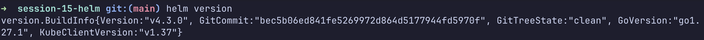
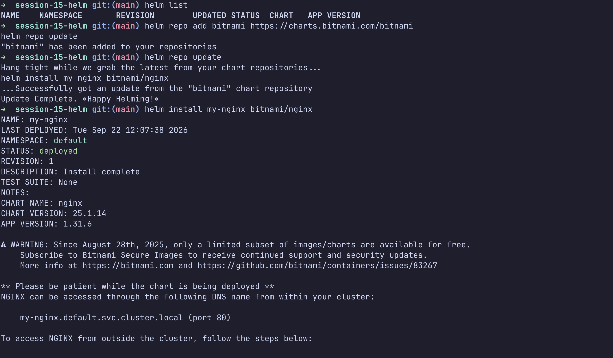
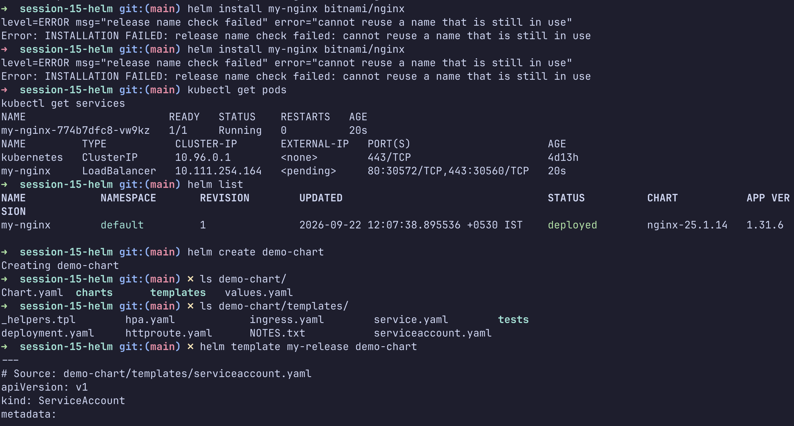
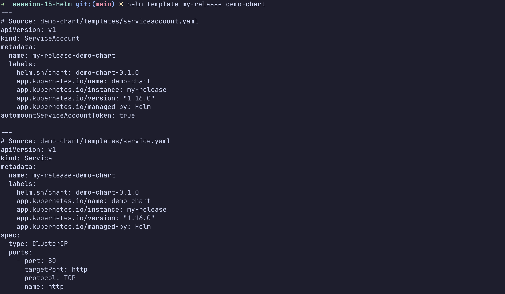
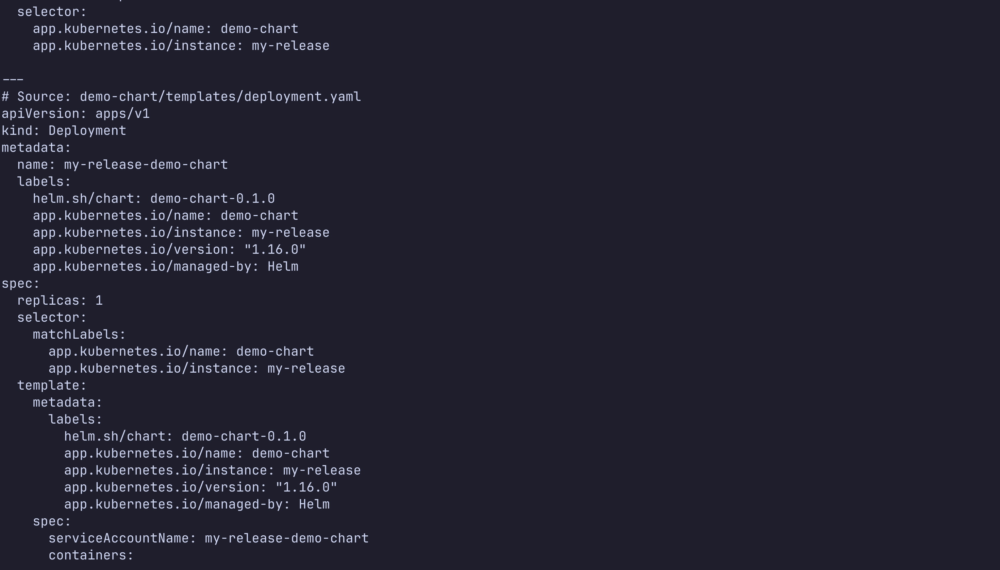
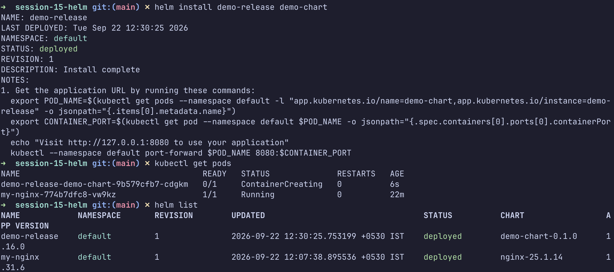

The mini-project screenshots capture chart linting, rendering, installation,
upgrade, the intentionally broken image, and the rollback verification:

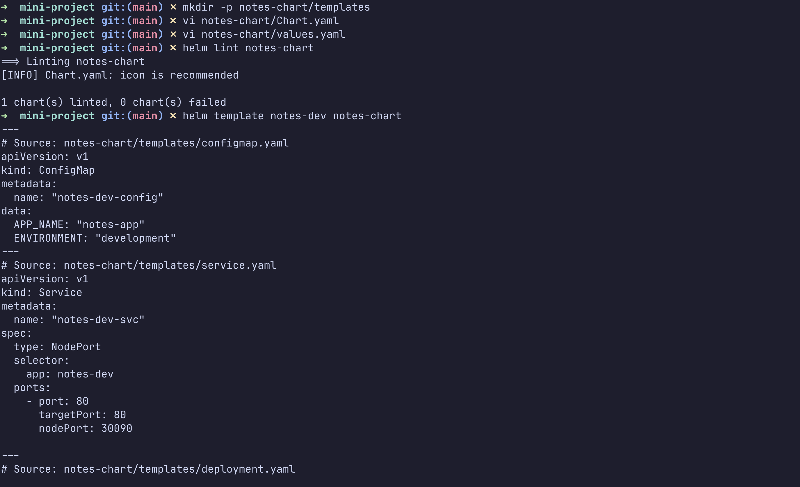
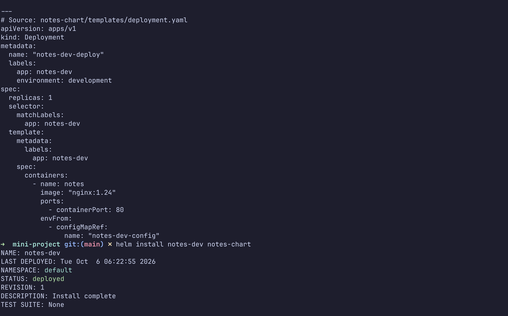
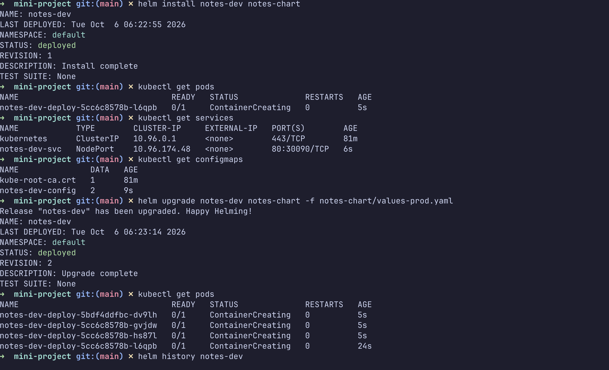
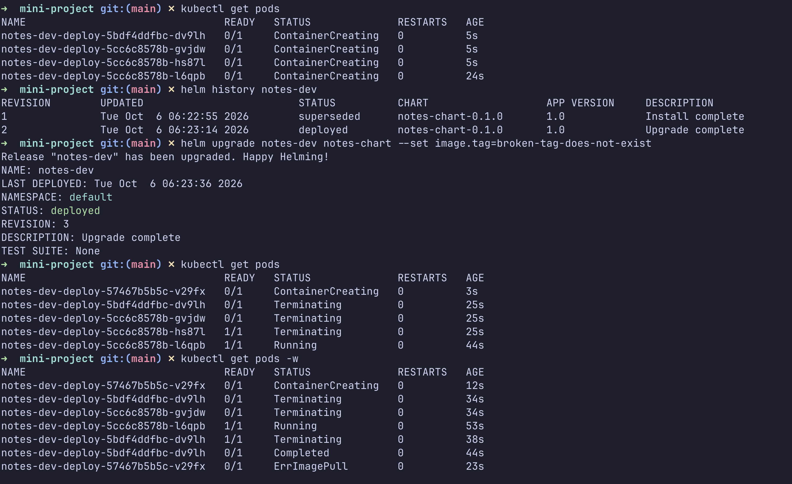
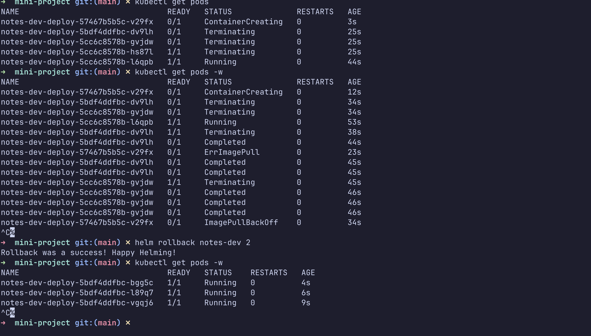


