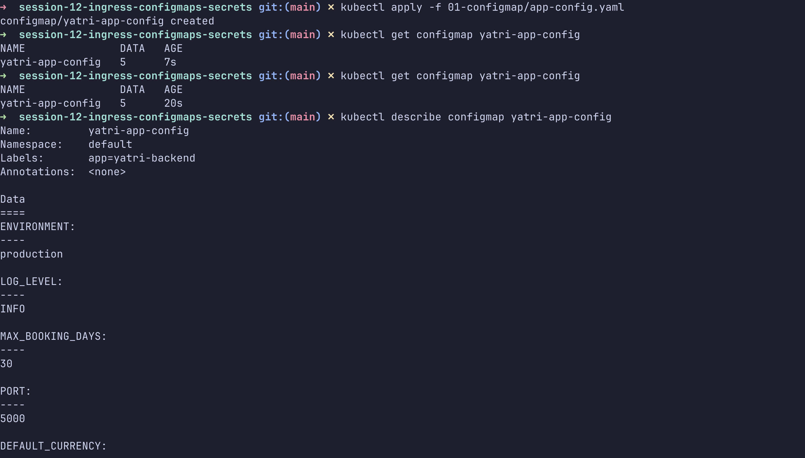
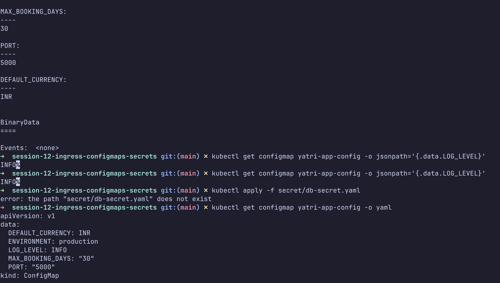
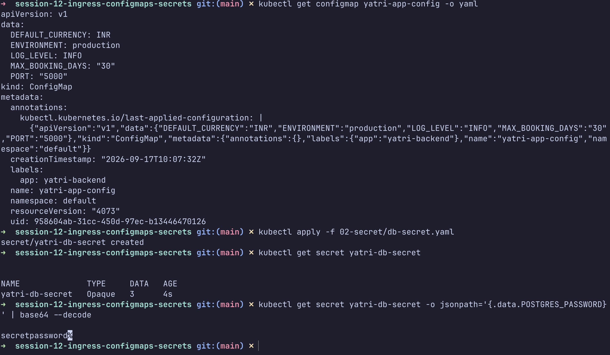
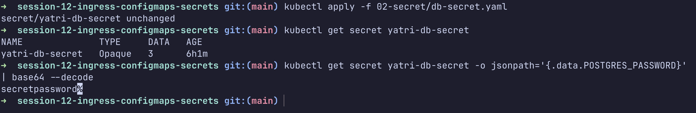
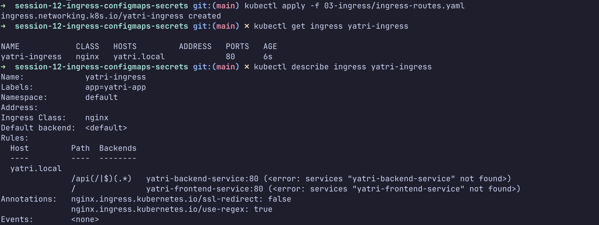
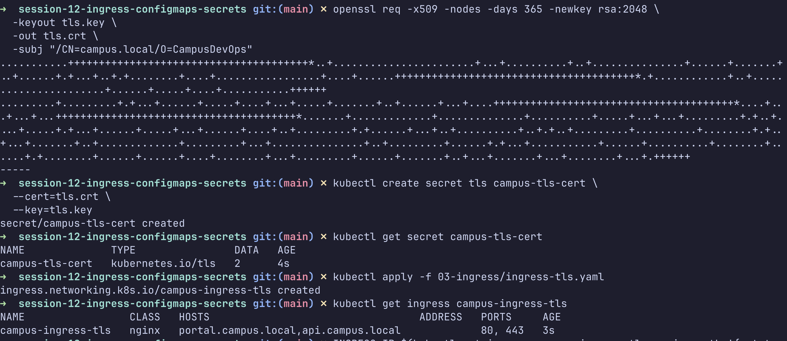

# Kubernetes Ingress, ConfigMaps and Secrets

This assignment demonstrates how to create and verify Kubernetes ConfigMaps, Secrets, Ingress routes, and TLS configuration.

## Topics Covered

- Creating and inspecting a ConfigMap
- Reading ConfigMap values with `jsonpath`
- Creating and decoding Kubernetes Secrets
- Configuring Ingress routes
- Creating a TLS Secret
- Configuring HTTPS Ingress

## 1. ConfigMap

Created the `yatri-app-config` ConfigMap with application configuration values:

- `ENVIRONMENT=production`
- `LOG_LEVEL=INFO`
- `MAX_BOOKING_DAYS=30`
- `PORT=5000`
- `DEFAULT_CURRENCY=INR`

```bash
kubectl apply -f 01-configmap/app-config.yaml
kubectl get configmap yatri-app-config
kubectl describe configmap yatri-app-config
kubectl get configmap yatri-app-config -o yaml
```





## 2. Secret

Created the `yatri-db-secret` Secret containing PostgreSQL credentials.

```bash
kubectl apply -f 02-secret/db-secret.yaml
kubectl get secret yatri-db-secret
```

Secret values are Base64 encoded. Base64 is encoding, not encryption.

```bash
kubectl get secret yatri-db-secret \
	-o jsonpath='{.data.POSTGRES_PASSWORD}' | base64 --decode
```





## 3. Ingress Routes

Created the `yatri-ingress` resource using the NGINX Ingress Controller.

The Ingress routes requests for `yatri.local` to the frontend and backend services.

```bash
kubectl apply -f 03-ingress/ingress-routes.yaml
kubectl get ingress yatri-ingress
kubectl describe ingress yatri-ingress
```



## 4. TLS Ingress

Generated a self-signed certificate and created the `campus-tls-cert` TLS Secret.

```bash
openssl req -x509 -nodes -days 365 -newkey rsa:2048 \
	-keyout tls.key \
	-out tls.crt \
	-subj "/CN=campus.local/O=CampusDevOps"

kubectl create secret tls campus-tls-cert \
	--cert=tls.crt \
	--key=tls.key

kubectl apply -f 03-ingress/ingress-tls.yaml
kubectl get ingress campus-ingress-tls
```

The TLS Ingress serves:

- `portal.campus.local`
- `api.campus.local`



## Important Notes

- Use `echo -n` when Base64 encoding Secret values to avoid adding a newline.
- ConfigMaps are intended for non-sensitive configuration.
- Secrets should be protected with appropriate RBAC permissions.
- Kubernetes Secrets use Base64 encoding by default; they are not automatically encrypted.
