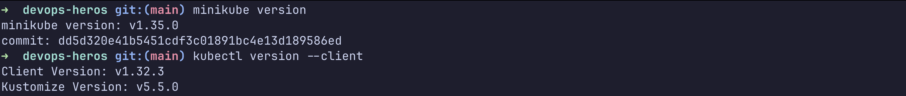
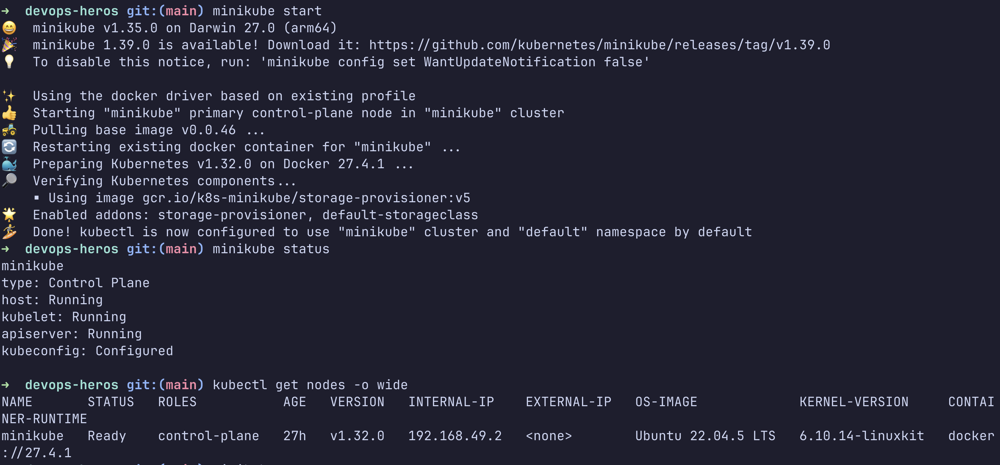
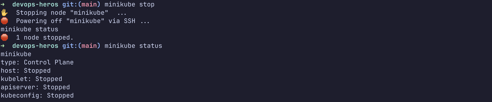

## Task 1: Minikube & CLI Installation Verification

## Task 2: Starting the Minikube Kubernetes Cluster

## Task 3: Verifying Cluster Status & Node Health

## Task 4: Stopping the Minikube Cluster

## Task 5: Kubernetes Cluster Architecture & Component Analysis

A Kubernetes cluster has two main parts: the control plane and the worker nodes. The control plane manages the cluster and keeps the desired state in etcd through the Kubernetes API. The scheduler decides which node should run each pod, and the controllers continuously compare the current state with the desired state to fix drift.

The worker nodes run the actual application containers. Each node has kubelet to manage pods, kube-proxy to handle networking, and a container runtime such as containerd to start and monitor containers. A pod is the smallest deployable unit, and it groups one or more containers that share the same network and storage. In short, the control plane decides what should run, while the worker nodes do the actual work.
