# Session 13: Kubernetes Storage, HPA and Probes

This assignment demonstrates temporary and persistent Kubernetes storage, CPU-based
horizontal scaling, and application health probes. The commands below were tested
with Minikube and the captured results are linked in the evidence section.

## Deliverables

- Volume documentation and working manifests
- HPA deployment, configuration, and load generator
- CPU and pod scaling observations
- Screenshots of the practical work
- Production-style mini-project with PVC, Service, HPA, and probes

## Prerequisites

```bash
minikube start
minikube addons enable metrics-server
kubectl get nodes
kubectl top nodes
```

The Metrics Server is required for `kubectl top` and for an HPA based on CPU
utilization. The exact CPU values and pod names vary by cluster.

## Task 1: Kubernetes Volumes

### `emptyDir`

`emptyDir` creates an empty directory when a Pod is assigned to a node. It is
available to one or more containers in that Pod and lasts for the lifetime of the
Pod. It is useful for scratch space, caches, and sharing files between containers.
Deleting and recreating the Pod creates a new empty directory, so the data is lost.

Example from [`emptydir-pod.yaml`](../../session-13-storage-hpa-probes/01-volumes/emptydir-pod.yaml):

```yaml
volumes:
	- name: app-storage
		emptyDir: {}
```

```bash
kubectl apply -f ../../session-13-storage-hpa-probes/01-volumes/emptydir-pod.yaml
kubectl exec -it emptydir-demo -- bash
echo "Hello Kubernetes" > /data/message.txt
cat /data/message.txt
exit
kubectl delete pod emptydir-demo
kubectl apply -f ../../session-13-storage-hpa-probes/01-volumes/emptydir-pod.yaml
kubectl exec emptydir-demo -- cat /data/message.txt
```

The final command returns `No such file or directory`, confirming that the
`emptyDir` data was tied to the deleted Pod.

### `hostPath`

`hostPath` mounts a directory from the Kubernetes node into a Pod. The example
uses `DirectoryOrCreate`, so Kubernetes creates `/tmp/hostpath-data` when needed:

```yaml
volumes:
	- name: host-storage
		hostPath:
			path: /tmp/hostpath-data
			type: DirectoryOrCreate
```

```bash
kubectl apply -f ../../session-13-storage-hpa-probes/01-volumes/hostpath-pod.yaml
kubectl exec hostpath-demo -- sh -c 'echo "node data" > /data/message.txt'
kubectl exec hostpath-demo -- cat /data/message.txt
```

`hostPath` is convenient for local learning and node-level use cases, but it
couples a workload to a particular node and is usually not appropriate for
portable production application storage.

### PersistentVolume and PersistentVolumeClaim

- A **PersistentVolume (PV)** is cluster storage made available to workloads.
- A **PersistentVolumeClaim (PVC)** is a request for storage with a required size
	and access mode.
- A Pod mounts the PVC; Kubernetes binds it to a suitable PV.

The static example creates a `1Gi` PV with `ReadWriteOnce` and a `Retain` reclaim
policy. The PVC requests `500Mi` and binds to that PV:

```bash
kubectl apply -f ../../session-13-storage-hpa-probes/02-persistent-storage/pv.yaml
kubectl apply -f ../../session-13-storage-hpa-probes/02-persistent-storage/pvc.yaml
kubectl get pv
kubectl get pvc
kubectl apply -f ../../session-13-storage-hpa-probes/02-persistent-storage/pod.yaml
```

The Pod stores data at `/data`:

```bash
kubectl exec storage-demo -- sh -c 'echo "Kubernetes Storage" > /data/message.txt'
kubectl exec storage-demo -- cat /data/message.txt
kubectl delete pod storage-demo
kubectl apply -f ../../session-13-storage-hpa-probes/02-persistent-storage/pod.yaml
kubectl exec storage-demo -- cat /data/message.txt
```

The file remains after the Pod is recreated because the data belongs to the PV,
not to the Pod filesystem. `ReadWriteOnce` permits read/write mounting by one
node; other access modes include `ReadOnlyMany`, `ReadWriteMany`, and
`ReadWriteOncePod`.

### StorageClass and dynamic provisioning

A **StorageClass** describes a storage type and its provisioner. With dynamic
provisioning, a user creates a PVC and Kubernetes automatically creates and binds
the backing PV. An administrator does not need to pre-create one PV per request.

```bash
kubectl get storageclass
kubectl describe storageclass standard
kubectl apply -f ../../session-13-storage-hpa-probes/03-storageclass/pvc.yaml
kubectl get pvc dynamic-pvc
kubectl get pv
```

In Minikube, the default `standard` class uses the
`k8s.io/minikube-hostpath` provisioner. The dynamically created PV receives a
generated name such as `pvc-<uid>` and is bound to `dynamic-pvc`.

The storage flow is:

```text
PVC -> StorageClass -> provisioner -> dynamically created PV -> Pod mount
```

The exact StorageClass and provisioner depend on the Kubernetes distribution.

## Task 2: HPA Hands-on

The standalone HPA example is in [`04-hpa`](../../session-13-storage-hpa-probes/04-hpa/).
The deployment requests `100m` CPU and the HPA targets 50% average CPU utilization,
with one minimum and five maximum replicas.

### Deploy the application and HPA

```bash
cd ../../session-13-storage-hpa-probes/04-hpa
kubectl apply -f deployment.yaml
kubectl apply -f service.yaml
kubectl apply -f hpa.yaml
kubectl get deployment
kubectl get pods
kubectl get svc
kubectl get hpa
```

Representative initial state:

```text
NAME       REFERENCE            TARGETS   MINPODS   MAXPODS   REPLICAS
hpa-demo   Deployment/hpa-demo  0%/50%    1         5         1
```

### Observe metrics and HPA decisions

```bash
kubectl top nodes
kubectl top pods
kubectl describe hpa hpa-demo
```

`kubectl top pods` reports the current CPU usage. HPA compares that usage with the
container CPU request (`100m`), not with the node's total CPU capacity. For
example, `50m` usage against a `100m` request is 50% utilization.

### Generate load and watch scaling

The simple in-cluster load generator continuously requests the Service:

```bash
kubectl run load-generator \
	--image=busybox:1.36 \
	--restart=Never \
	-- /bin/sh -c \
	'while true; do wget -q -O- http://hpa-demo-service; done'

kubectl get pods -w
kubectl get hpa -w
kubectl top pods
```

The repository also contains a reusable local script at
[`load_generator.sh`](../../session-13-storage-hpa-probes/hpa/load_generator.sh).
It starts ten parallel `curl` workers against a supplied health endpoint.

When the measured average CPU exceeds the 50% target, the HPA increases the
Deployment replica count, up to five. HPA decisions are sampled periodically, so
scaling is not instantaneous. Stop the test with:

```bash
kubectl delete pod load-generator
kubectl get hpa -w
```

After the stabilization period, replicas can scale back toward the minimum.

## Task 3: Mini Project

The mini-project deploys an NGINX application in the dedicated
`production-webapp` namespace. Its manifests are in
[`session-13-storage-hpa-probes/mini-project`](../../session-13-storage-hpa-probes/mini-project/).

### Architecture

```text
Service web-service:80
					|
		 web-app Pods (2 to 5 replicas)
			 |       |       |
	 probes  probes  probes
					|
		 PVC web-data (500Mi, RWO)
					|
	 StorageClass standard
```

The Deployment defines CPU requests and limits, mounts the PVC at `/data`, and
uses HTTP probes against `/` on port 80:

- **Startup probe** allows the application time to initialize before the other
	probes control the container.
- **Readiness probe** controls whether the Pod is included in Service endpoints.
- **Liveness probe** restarts the container when it is no longer healthy.

### Deploy the mini-project

```bash
cd ../../session-13-storage-hpa-probes/mini-project
kubectl apply -f namespace.yaml
kubectl apply -f pvc.yaml
kubectl apply -f deployment.yaml
kubectl apply -f service.yaml
kubectl apply -f hpa.yaml

kubectl get pvc -n production-webapp
kubectl get pods -n production-webapp
kubectl get svc -n production-webapp
kubectl get hpa -n production-webapp
```

The expected HPA configuration is two minimum replicas, five maximum replicas,
and a 50% CPU target.

### Verify persistent data

```bash
POD_NAME=$(kubectl get pods -n production-webapp -l app=web-app \
	-o jsonpath='{.items[0].metadata.name}')
kubectl exec -n production-webapp "$POD_NAME" -- \
	sh -c 'echo "Student: Jane Doe" > /data/student.txt'
kubectl exec -n production-webapp "$POD_NAME" -- cat /data/student.txt

kubectl delete pod -n production-webapp "$POD_NAME"
kubectl wait --for=condition=Ready pod -n production-webapp \
	-l app=web-app --timeout=120s
NEW_POD=$(kubectl get pods -n production-webapp -l app=web-app \
	-o jsonpath='{.items[0].metadata.name}')
kubectl exec -n production-webapp "$NEW_POD" -- cat /data/student.txt
```

The same text is available after the Pod is replaced, proving that the PVC
outlives an individual Pod.

### Verify the Service and mini-project HPA

```bash
kubectl port-forward -n production-webapp svc/web-service 8080:80
curl http://localhost:8080
```

In another terminal, generate traffic and observe CPU and replicas:

```bash
kubectl run load-generator -n production-webapp \
	--image=busybox:1.36 \
	--restart=Never \
	-- /bin/sh -c 'while true; do wget -q -O- http://web-service; done'

kubectl get hpa -n production-webapp -w
kubectl get pods -n production-webapp -w
kubectl top pods -n production-webapp
kubectl describe hpa web-app-hpa -n production-webapp
kubectl delete pod load-generator -n production-webapp
```

## Evidence

The screenshots are grouped by practical exercise:

### Volumes and persistent storage

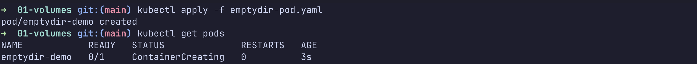
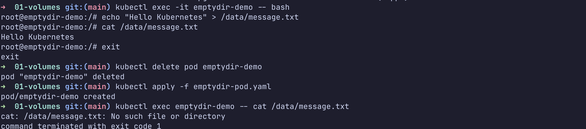

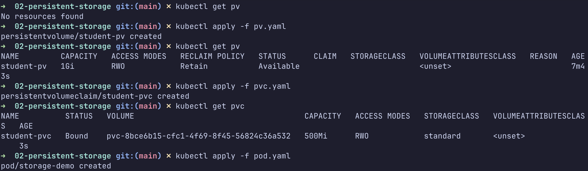
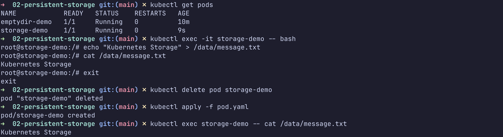

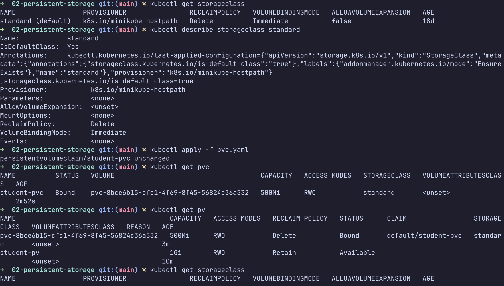
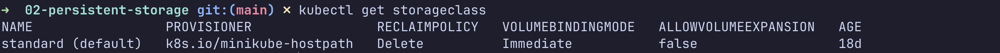

### HPA

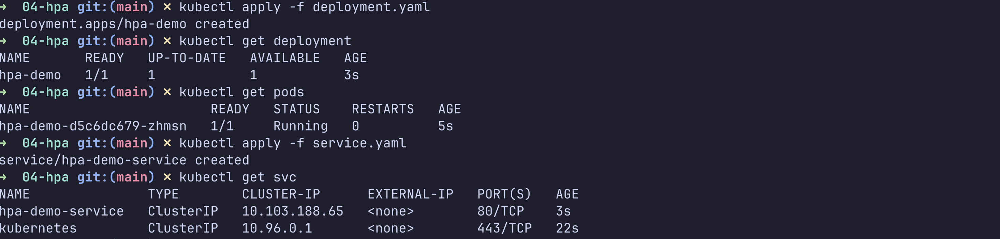
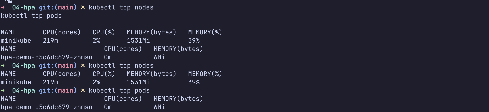
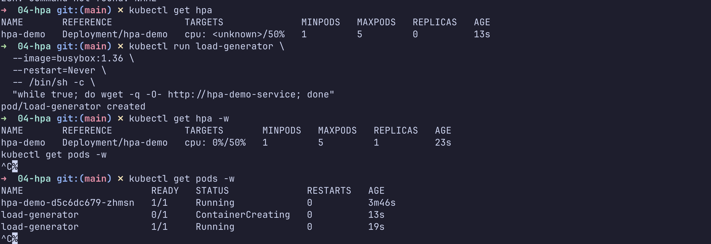
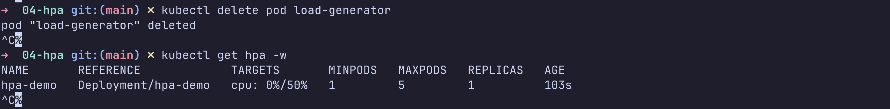

### Probes

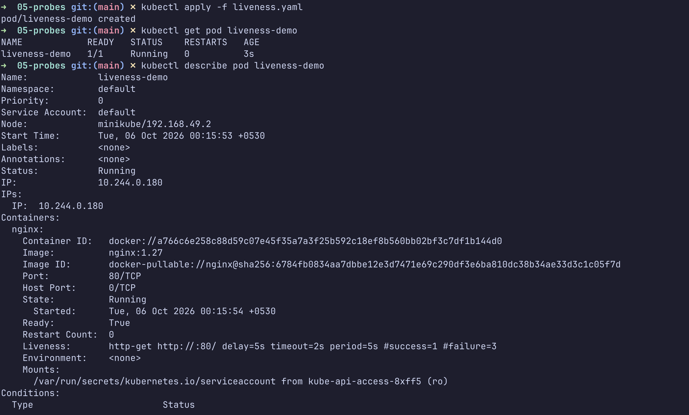
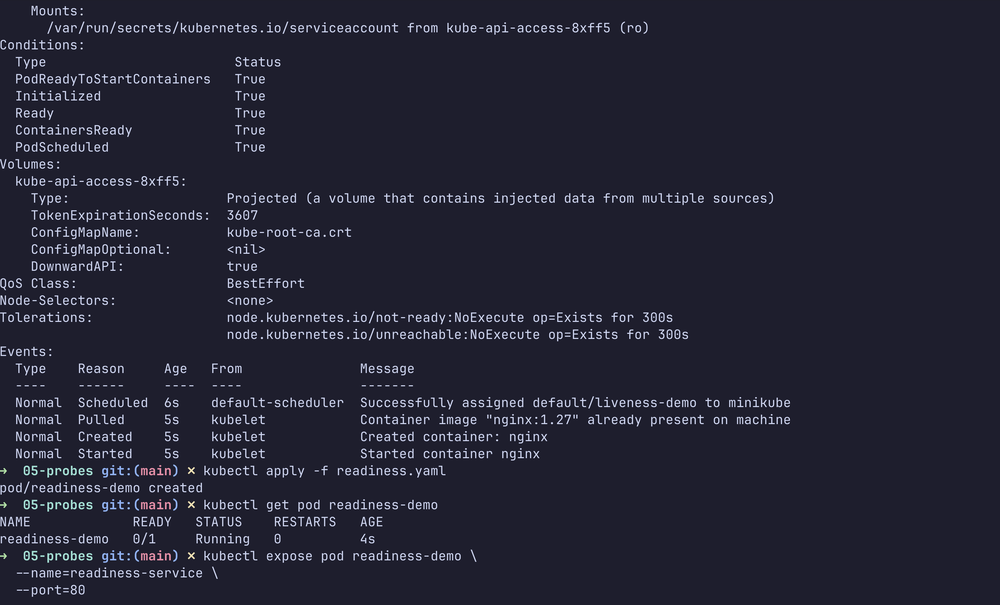
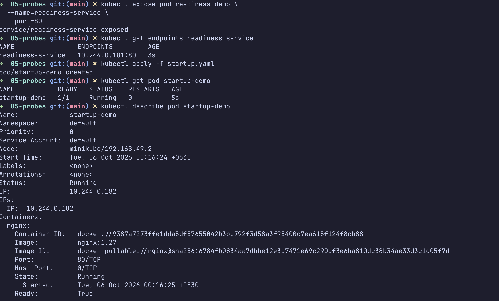
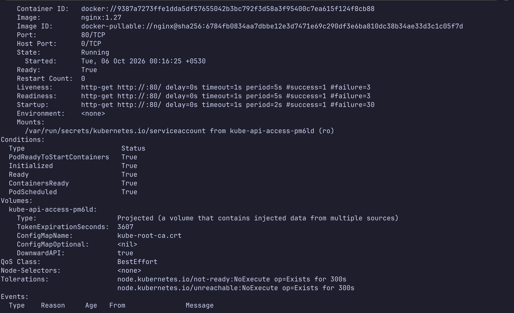
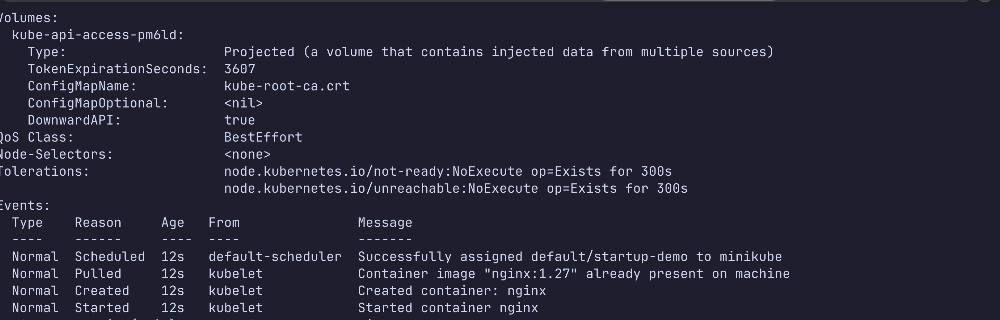
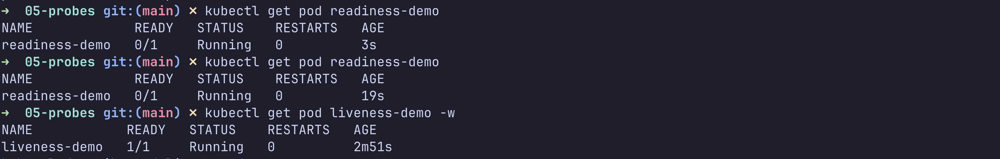
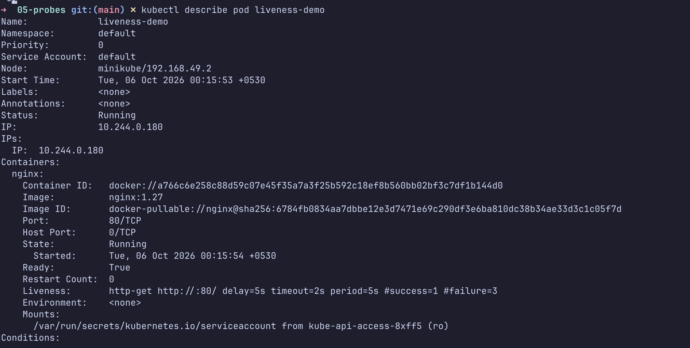
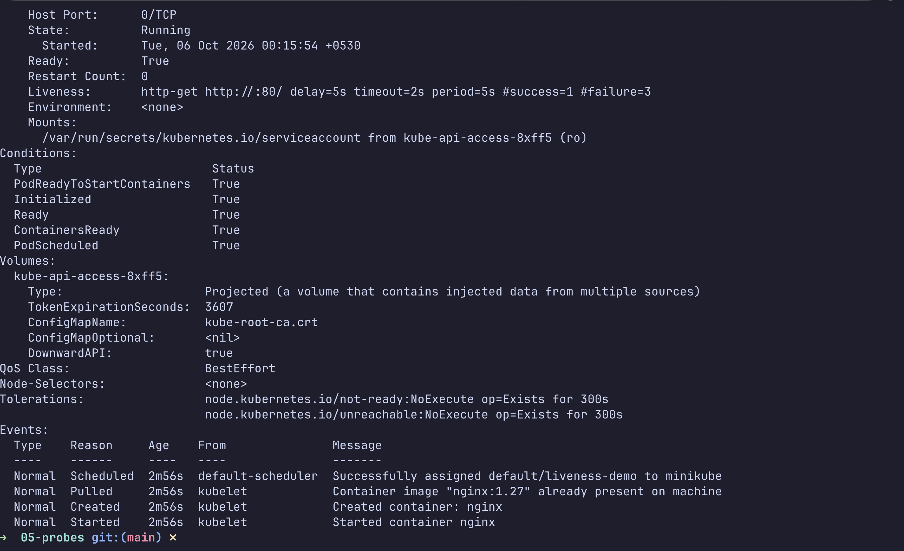

### Mini-project

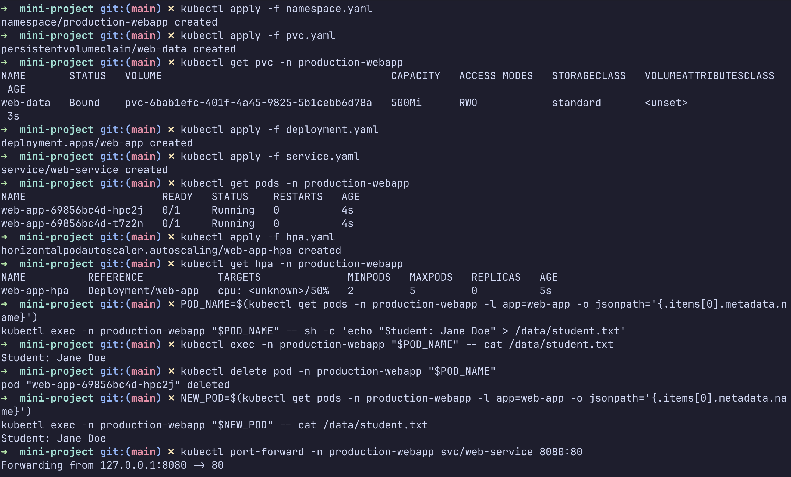
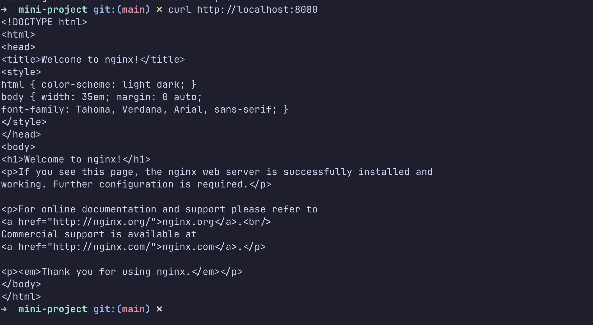
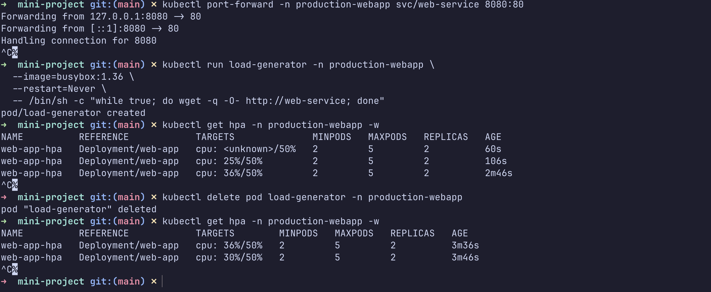

## Troubleshooting notes

### HPA shows `<unknown>`

Check the Metrics Server and CPU requests:

```bash
kubectl top pods
kubectl describe hpa hpa-demo
kubectl get pods -n kube-system | grep metrics-server
```

Enable the add-on on Minikube if necessary:

```bash
minikube addons enable metrics-server
```

### PVC remains `Pending`

```bash
kubectl get storageclass
kubectl describe pvc web-data -n production-webapp
kubectl get pv
```

The cluster needs a working StorageClass and provisioner. Minikube normally
provides the `standard` class through its hostpath provisioner.

### Pod is `Running` but not ready

Inspect the probe and events:

```bash
kubectl describe pod <pod-name> -n production-webapp
kubectl get endpoints web-service -n production-webapp
```

A failed readiness probe removes the Pod from Service endpoints without
restarting it. A failed liveness probe restarts the container; startup probe
failures prevent the container from being considered ready during initialization.
