# Session 18: Terraform and Infrastructure as Code

This assignment demonstrates Infrastructure as Code by creating and destroying
an AWS S3 bucket with Terraform, then researching the AWS services commonly used
with cloud infrastructure.

## Deliverables

- Terraform S3 project
- Complete `init`, `fmt`, `validate`, `plan`, `apply`, `show`, `output`, and
    `destroy` workflow
- IAM, EC2, S3, VPC, DynamoDB, and RDS research
- State and credential safety notes
- Hands-on screenshot evidence

## Project structure

The working project is in
[`session18-terraform-iac/terraform-s3-demo`](../../session18-terraform-iac/terraform-s3-demo/):

```text
terraform-s3-demo/
├── terraform.tf       # Terraform and provider constraints
├── providers.tf       # AWS provider configuration
├── variables.tf       # Region and bucket inputs
├── main.tf            # S3 bucket resource
├── outputs.tf         # Bucket name, ARN, and region
├── README.md
└── .gitignore         # Excludes state, plans, and tfvars files
```

The assignment prompt calls the provider file `provider.tf`; this implementation
uses the equivalent name `providers.tf`. Terraform loads both names the same way.
The project does not include a committed `terraform.tfvars` because `*.tfvars`
is excluded from version control.

## Prerequisites and safe setup

```bash
terraform version
aws --version
aws configure
aws sts get-caller-identity
```

The AWS provider defaults to `ap-south-1`. S3 bucket names are globally unique,
so use a unique value such as `session18-iac-<random-suffix>`.

Never commit AWS credentials, `terraform.tfvars`, `.terraform/`, state files, or
plan files. State can contain sensitive infrastructure details. Use an encrypted,
locked remote backend for team work.

## Task 1: Terraform S3 demo

### Configuration

The project requires Terraform 1.6 or newer and the AWS provider 6.x:

```hcl
terraform {
    required_version = ">= 1.6.0"
    required_providers {
        aws = {
            source  = "hashicorp/aws"
            version = "~> 6.0"
        }
    }
}
```

The main resource is `aws_s3_bucket.devops553`. It accepts `bucket_name` and
`aws_region` variables and tags the bucket as a development Session 18 resource.
It uses `force_destroy = true` for this disposable classroom exercise; use that
setting carefully in real environments because it permits deletion of bucket
contents during destroy.

### Complete workflow

Run these commands from the Terraform project directory:

```bash
cd ../../session18-terraform-iac/terraform-s3-demo
terraform init
terraform fmt
terraform validate
terraform plan \
    -var='bucket_name=session18-iac-unique-example' \
    -out=tfplan
terraform apply tfplan
terraform show
terraform output
terraform state list
terraform destroy \
    -var='bucket_name=session18-iac-unique-example'
```

### `terraform init`

Downloads the AWS provider and creates or updates `.terraform.lock.hcl`:

```text
Terraform has been successfully initialized!
```

Commit the lock file so provider selections remain reproducible.

### `terraform fmt` and `terraform validate`

```bash
terraform fmt
terraform validate
```

Expected validation output:

```text
Success! The configuration is valid.
```

`validate` checks syntax and configuration consistency; it does not create AWS
resources.

### `terraform plan`

The plan previews changes without applying them:

```text
Plan: 1 to add, 0 to change, 0 to destroy.
```

Review the plan before approval. `-out=tfplan` saves the exact plan for
`terraform apply tfplan`; the generated plan is ignored by Git.

### `terraform apply`

Apply the reviewed plan or approve interactively with `yes`:

```text
Apply complete! Resources: 1 added, 0 changed, 0 destroyed.
```

The S3 bucket is now managed by Terraform and recorded in state.

### `terraform show`, state, and outputs

```bash
terraform show
terraform state list
terraform state show aws_s3_bucket.devops553
terraform output
terraform output bucket_name
terraform output bucket_arn
terraform output bucket_region
```

The outputs provide the bucket name, AWS ARN, and region. `terraform show` and
`terraform state show` help inspect the real attributes recorded after apply.

Optional AWS CLI verification:

```bash
aws s3 ls
aws s3api head-bucket --bucket "$(terraform output -raw bucket_name)"
```

### `terraform destroy`

Review the destroy plan before removing the classroom resource:

```bash
terraform plan -destroy \
    -var='bucket_name=session18-iac-unique-example'
terraform destroy \
    -var='bucket_name=session18-iac-unique-example'
```

Expected result after approval:

```text
Destroy complete! Resources: 1 destroyed.
```

## Task 2: AWS services research

### 01. IAM - governance

AWS Identity and Access Management controls authentication and authorization.

- **Users** represent people or long-lived identities.
- **Groups** collect users with common permissions.
- **Roles** are assumable identities that provide temporary credentials to users,
    AWS services, CI/CD systems, or workloads.
- **Policies** are JSON documents describing `Effect`, `Action`, `Resource`, and
    optional `Condition` rules.
- **Permissions** are the effective allowed actions after identity policies,
    resource policies, boundaries, and organization controls are evaluated.
- **Least privilege** means granting only the access required for a task and no
    more.

Best practices include MFA, roles instead of shared access keys, no root-user
daily work, permission reviews, CloudTrail auditing, strong credential controls,
and short-lived credentials for automation. Common uses include developer access,
service roles, CI/CD deployment roles, and cross-account access.

### 02. EC2 - compute

Amazon EC2 provides resizable virtual machines called instances.

- **AMI:** Launch image containing an operating system and initial software.
- **Instance type:** Defines CPU, memory, storage, network, and price profile.
- **Key pair:** SSH authentication material for Linux instances.
- **Security group:** Stateful virtual firewall attached to an instance network
    interface.
- **EBS:** Persistent block storage attached to an instance.
- **Public IP:** Internet-reachable address when routing and security rules allow.
- **Private IP:** Address used inside the VPC.
- **Lifecycle:** Pending, running, stopping, stopped, shutting down, and
    terminated. Termination is normally irreversible.

EC2 is used for web servers, batch jobs, build runners, self-managed databases,
and applications that need virtual-machine control.

### 03. S3 - storage

S3 is regional object storage. A **bucket** is a globally unique container and an
**object** is data plus metadata addressed by a key.

- Storage classes include Standard, Intelligent-Tiering, Standard-IA, One Zone-IA,
    and Glacier classes.
- Versioning preserves older object versions and helps recover from overwrites.
- Lifecycle rules transition objects to cheaper classes or expire old objects.
- Encryption can use S3-managed keys, AWS KMS keys, or customer-provided keys.
- Bucket policies are resource-based JSON policies; keep buckets private by
    default and grant only required access.

Common uses include backups, static websites, logs, data lakes, artifacts, and
user-uploaded media.

### 04. VPC - networking

Amazon VPC is an isolated virtual network for AWS resources.

- **CIDR:** Address range such as `10.0.0.0/16`.
- **Subnets:** Smaller address ranges placed in Availability Zones.
- **Route tables:** Determine where subnet traffic goes.
- **Internet Gateway:** Connects public routes to the internet.
- **NAT Gateway:** Allows private resources to initiate outbound internet traffic.
- **Security groups:** Stateful resource-level firewalls.
- **Network ACLs:** Stateless, ordered subnet-level allow and deny rules.
- A **public subnet** has a route to an Internet Gateway; a **private subnet** does
    not accept direct inbound internet traffic and may use NAT for outbound access.

A common design places load balancers in public subnets, application instances in
private subnets, and databases in isolated private subnets.

### 05. DynamoDB and RDS - databases

**DynamoDB** is a managed NoSQL key-value and document database:

- A table stores records.
- An item is one record.
- Attributes are item fields.
- A partition key distributes items and traffic.
- An optional sort key orders related items within a partition key.

DynamoDB suits high-scale key-value access, sessions, carts, IoT data, and
serverless applications designed around known access patterns.

**RDS** is managed relational database infrastructure. Supported engines include
Aurora, PostgreSQL, MySQL, MariaDB, Oracle, and SQL Server. An RDS DB instance
provides compute and storage while AWS handles much of provisioning, patching,
backup, monitoring, and recovery. Multi-AZ provides standby failover; read
replicas provide asynchronous read scaling. Use private subnets, security groups,
encryption, backups, Secrets Manager, and deletion protection where appropriate.
RDS suits SQL, transactions, joins, and foreign-key workloads.

## Evidence

### Session 18 S3 and Terraform workflow


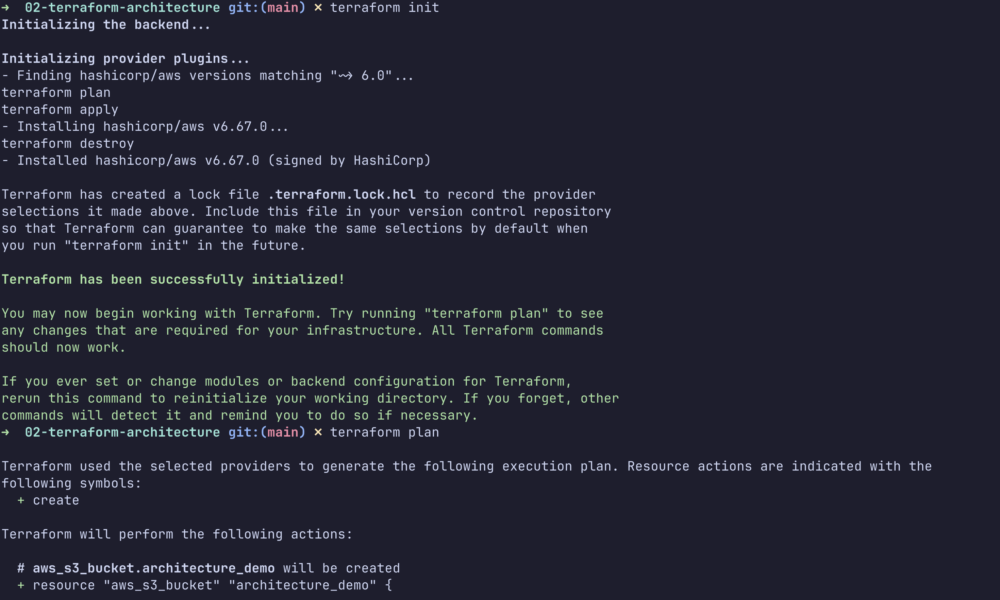
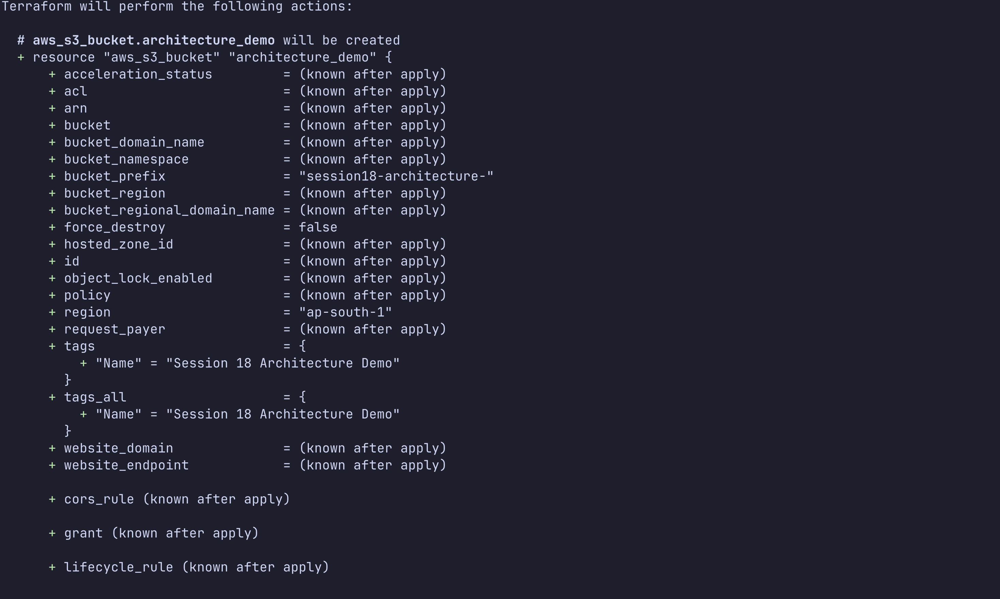
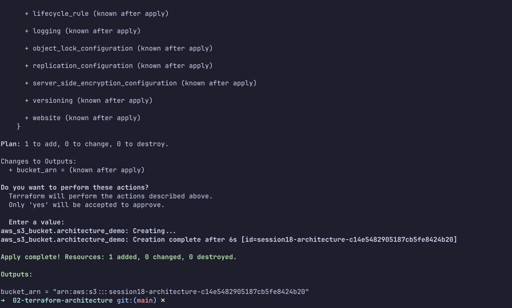


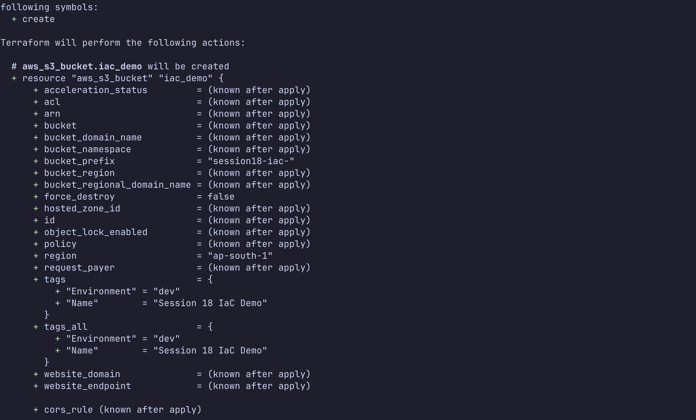
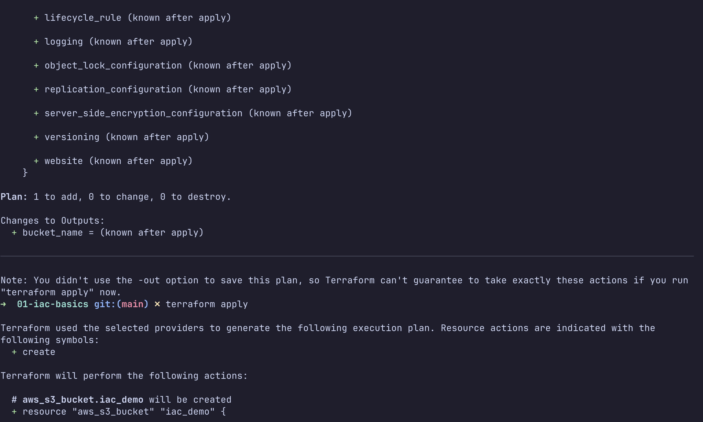

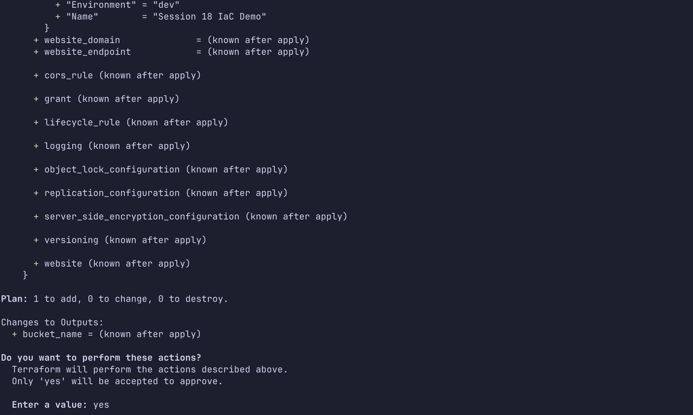
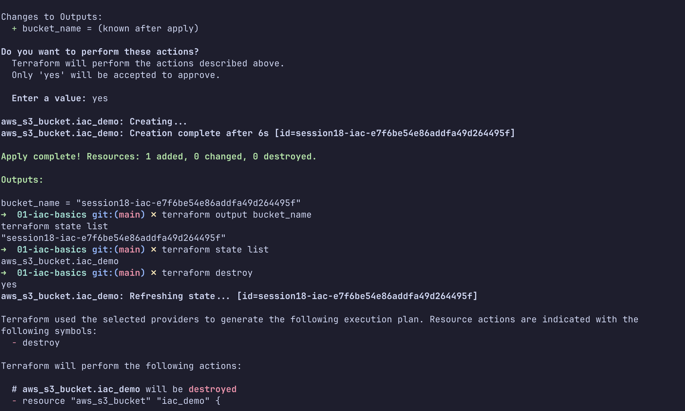

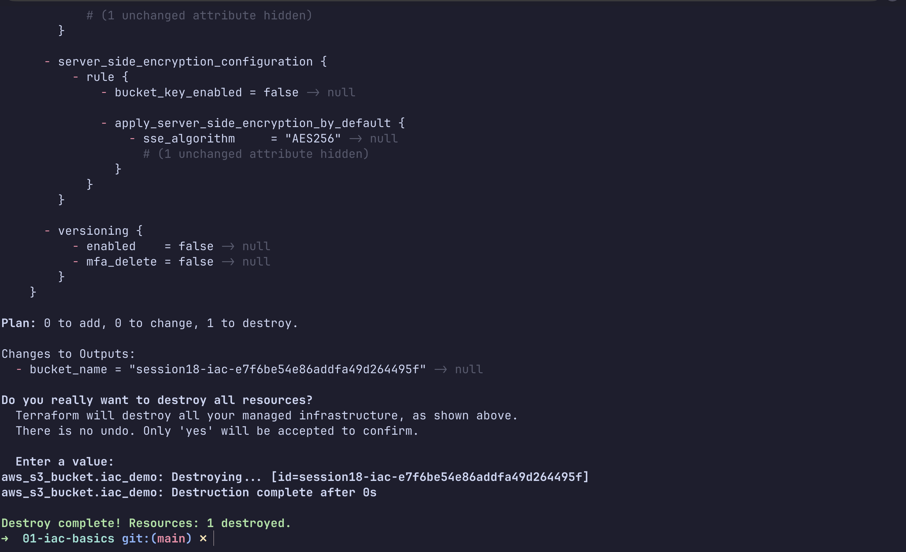

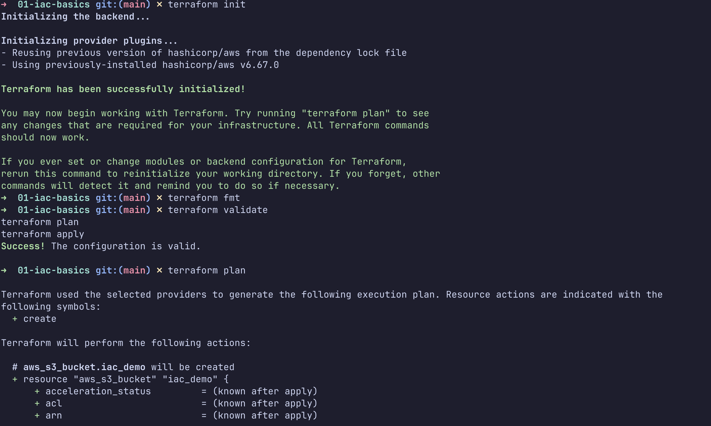


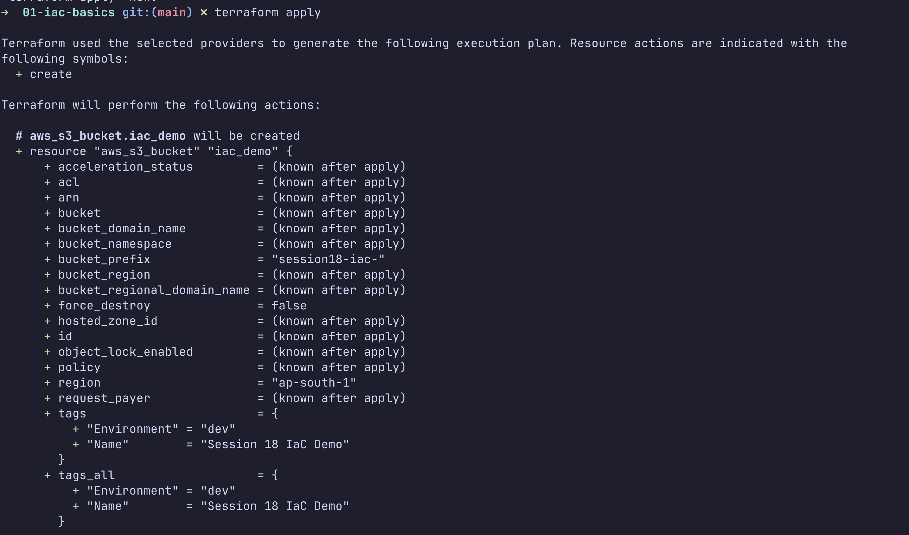


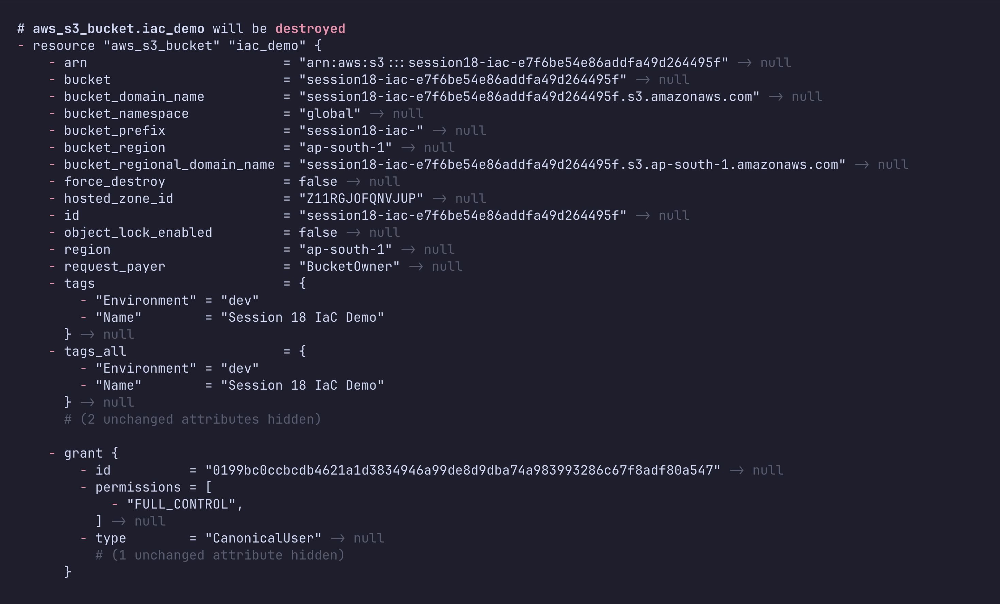


### Related Cloud Terraform evidence

These additional screenshots belong to the separate Cloud Terraform project, but
they reinforce the AWS service research by showing Terraform-managed VPC, subnet,
security group, EC2, S3, and browser verification:

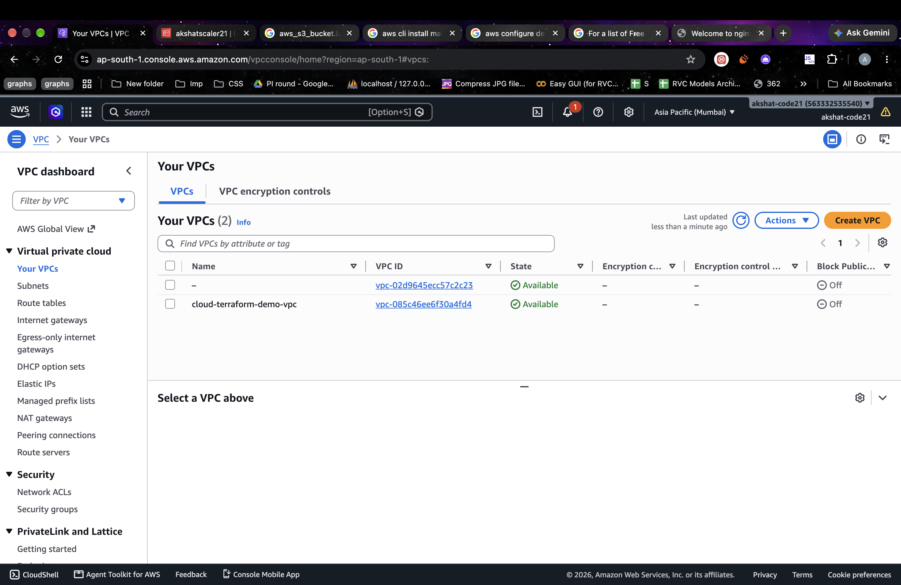
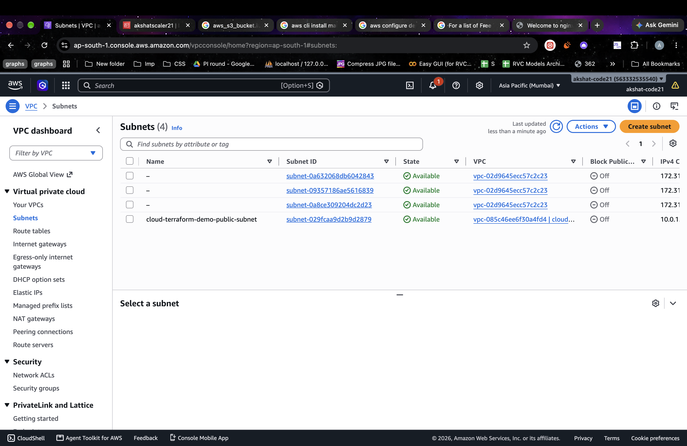
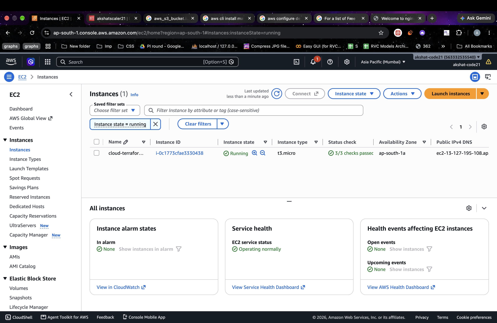
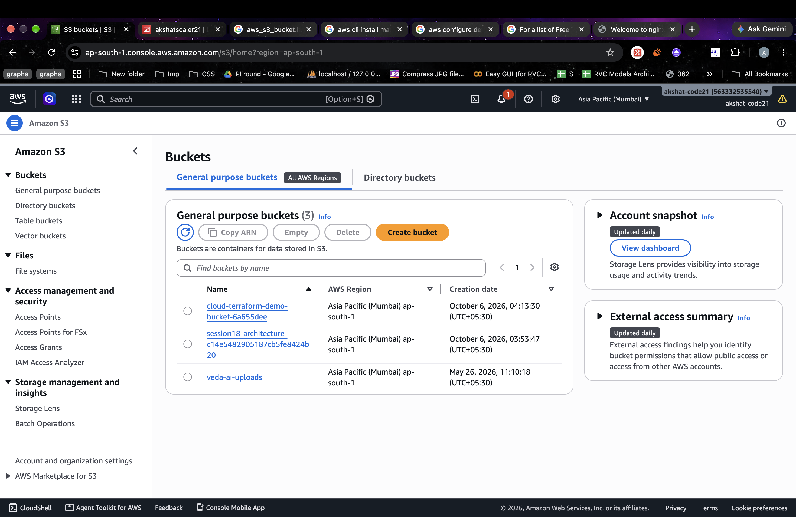
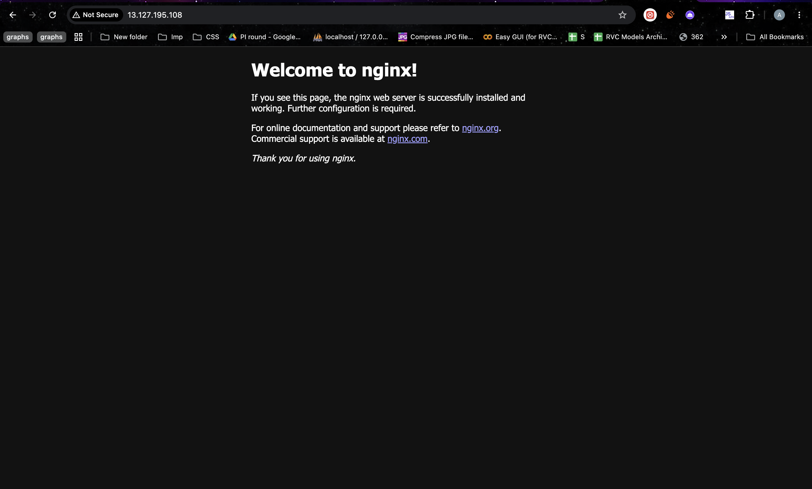

## Checklist

```text
[x] Terraform S3 project structure documented
[x] AWS provider, variables, resource, and outputs documented
[x] init, fmt, validate, plan, apply, show, output, and destroy documented
[x] IAM, EC2, S3, VPC, DynamoDB, and RDS research documented
[x] State, credentials, and globally unique bucket names addressed
[x] Session 18 screenshots linked
[x] Related Cloud Terraform evidence linked
```
